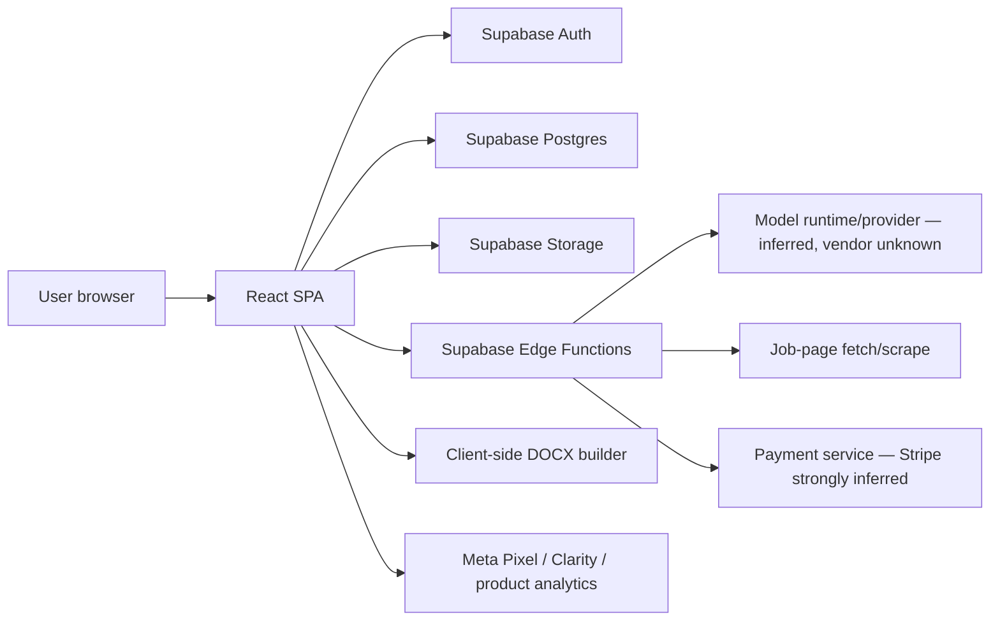
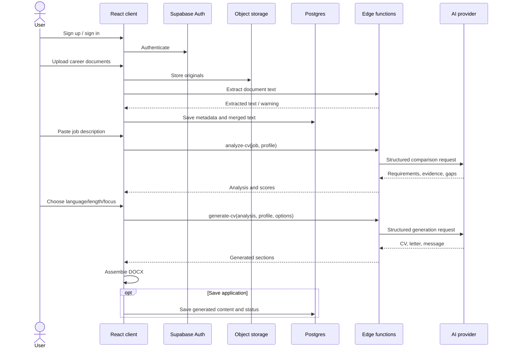

# Shortlisted.nu — functional reverse engineering

Date observed: 17 July 2026  
Scope: public pages plus an authenticated, user-authorized profile → job analysis → CV generation flow.

## What this document is—and is not

This is a black-box product and systems teardown. It is based on visible UI behavior, browser-delivered application assets, network-facing contracts, public policies, and one controlled end-to-end run. It does **not** claim access to Shortlisted's private source code, database, model prompts, vendor agreements, or deployment console.

Evidence labels used below:

- **Observed** — directly visible in the running product or browser-delivered code.
- **High-confidence inference** — strongly implied by bundled libraries, routes, and request shapes.
- **Proposed** — our recommended replacement design; see the companion architecture document.

No personal CV text or personal facts from the test account are reproduced here.

## Executive summary

Shortlisted is a single-page CV-tailoring application with a fairly compact architecture:

1. Users create a profile and upload career documents.
2. The client stores files and extracted text through Supabase.
3. A job description is pasted or scraped from a URL.
4. An AI-backed analysis function creates a requirement-to-evidence map and match score.
5. A second AI-backed function produces a CV, cover letter, and LinkedIn message.
6. The browser renders and downloads Word documents.
7. Saved applications, subscription state, support, blog, and admin features share the same application.

The valuable pattern is the two-stage workflow—analyze first, generate second. The weak points are evidence grounding, score integrity, editability, ATS verification, data handling, consent, and the absence of a visible genuine learning loop. A better product should preserve the staged workflow while making every generated claim traceable to source evidence, recomputing the match after editing, and separating a stable career fact ledger from job-specific documents.

## Product map

### Public routes

| Route | Purpose | Evidence |
|---|---|---|
| `/` | Landing page, feature explanation, plans, calls to action | Observed |
| `/example` | Before/after CV example | Observed |
| `/auth` | Email/password and Google authentication | Observed |
| `/email-confirmed` | Confirmation success | Observed in route bundle |
| `/reset-password` | Recovery-session password form | Observed in route bundle |
| `/complete-profile` | Invite/magic-link onboarding | Observed in route bundle |
| `/terms` | Terms and subscription terms | Observed |
| `/privacy` | Privacy notice | Observed |
| `/cookies` | Cookie notice | Observed |
| `/unsubscribe` | Email unsubscribe | Observed |
| `/blog`, `/blogg`, article slugs | Content/SEO | Observed |

### Authenticated routes

| Route | Purpose | Evidence |
|---|---|---|
| `/welcome` | Onboarding | Observed in route bundle |
| `/profile` | Contact data, source documents, extracted profile basis | Observed and tested |
| `/create` | Job input, match analysis, document generation | Observed and tested |
| `/applications` | Saved application/document history | Observed in UI and bundle |
| `/dashboard` | Legacy alias rendering the applications experience | Observed in route bundle |
| `/subscription` | Plan and payment management | Observed in route bundle |
| `/account` | Password/account controls | Observed in route bundle |
| `/support` | Support ticket submission | Observed in route bundle |
| `/admin` | User/blog/support administration with a separate admin check | Observed in route bundle |

### Onboarding and profile

The sign-up form collects first name, last name, email, optional phone, password, and acceptance of terms. It supports email confirmation and Google sign-in.

The profile accepts:

- CVs: PDF, DOCX, JPG, PNG, and WEBP; multiple files are possible.
- LinkedIn profile export: PDF.
- Certificates: PDF or images.
- Contact data and a small set of manually entered profile fields.

Files are stored separately from metadata. Extracted text is merged into a profile-level text field and also cached in browser storage. During the controlled run, PDF extraction worked; the application warned that Word extraction was not fully supported and recommended conversion to PDF.

### Job intake

The form supports:

- an optional job URL;
- title and company;
- a required job description with a minimum of approximately 100 words;
- an optional recruiter/hiring-manager name;
- automatic Swedish/English detection based on simple language cues.

LinkedIn job URLs are explicitly restricted. URL scraping is delegated to a backend function for other sites.

### Analysis

The analysis maps job requirements to profile evidence, then returns strengths, gaps, keywords, adjacent/transferable strengths, an explanation, and a recommendation. Analysis is available before document generation and appears not to require an active paid plan; the richer result/generation path is gated.

The client sends a payload equivalent to:

```json
{
  "job": {
    "title": "…",
    "company": "…",
    "description_text": "…",
    "language_hint": "sv"
  },
  "profile": {
    "documents_text": "…",
    "manual_fields": {
      "skills": [],
      "languages": [],
      "systems": [],
      "certifications": []
    },
    "contact": {}
  },
  "profile_basis": {
    "documents_used": []
  },
  "options": {
    "output_language": "sv"
  }
}
```

The response shape includes fields equivalent to:

```json
{
  "fit": {
    "match_score": 0,
    "strengths": [],
    "gaps": [],
    "matched_keywords": [],
    "requirements_matrix": [],
    "adjacent_synergies": [],
    "score_explanation": "…",
    "recommendation": "…"
  },
  "language": "sv"
}
```

### Scoring behavior

The UI explains a weighted score:

```text
raw score = must-have coverage × 0.70
          + merit coverage × 0.20
          + transferable-strength bonus × 0.10
```

Displayed interpretation bands are approximately:

| Score | Label |
|---:|---|
| 85–100 | Strong match / high likelihood |
| 70–84 | Possible match / medium likelihood |
| 55–69 | Stretch |
| below 55 | Weak match |

The phrase “interview likelihood” is only a relabeling of the match score. There is no visible calibration data demonstrating that it is an actual probability.

#### Reproduced score defect

In the controlled run, the prominent score was **65%**. Its visible components were:

- must-have: `88 × 0.70 = 61.6`, displayed as 62;
- merit: `0 × 0.20 = 0`;
- transferable: `30 × 0.10 = 3`;
- mathematical total: approximately **65**.

The same breakdown showed a **70** total elsewhere, and the qualitative labels corresponded to 70 rather than 65. This indicates at least two score values—likely a raw deterministic score and a model/backend-adjusted final score—are being mixed in the UI. This is a trust-critical failure because a user cannot reproduce the displayed result from the displayed formula.

### Generation

The second stage sends the completed analysis plus the merged profile text and generation options:

```json
{
  "stageA": {},
  "merged_profile_text": "…",
  "options": {
    "cv_language": "sv",
    "cv_length": "1",
    "tone": "professional",
    "role_focus": "strategy_management",
    "recruiting_manager_name": "…"
  }
}
```

The generated response contains:

```json
{
  "optimized_cv": {
    "sections": [
      { "heading": "…", "content": "…" }
    ]
  },
  "cover_letter": { "text": "…" },
  "linkedin_message": { "text": "…" }
}
```

The current result has three tabs: CV, cover letter, and LinkedIn message. The controlled run produced all three, even without a named recruiter. The active CV style is a single-column, Calibri-based “Executive Professional — ATS Optimized” template with headings broadly equivalent to:

- header/contact;
- expertise and career objective;
- professional experience;
- education;
- IT and languages.

The CV and cover letter are assembled into DOCX in the browser. The UI directs the user to review the Word file and save it as PDF manually. A PDF library is bundled, but no active direct-PDF path was found in the tested flow.

### Saving and application tracking

Saving writes a record equivalent to the following into `saved_cvs`:

- user identifier;
- job title, company, description, URL, and recruiter;
- match score, strengths, gaps, and keywords;
- generated CV, cover letter, LinkedIn message, and analysis payload;
- application status and timestamps.

Visible statuses include applied, follow-up, interview, no offer, and offer.

### Subscription and use limits

Visible plans are a seven-day trial, SEK 95/week, and SEK 270/month. Stripe checkout and customer-portal functions are present. The marketing language says “unlimited,” while the terms set a limit of 20 generations per rolling 24 hours. Generation, downloads, and detailed results are gated by entitlement checks.

### Support, content, and administration

The same application contains categorized support-ticket submission, account/password controls, subscription management, a blog CMS surface, email-unsubscribe handling, and an administrator surface. Client route guards are visible, but actual security necessarily depends on server authorization and database row-level policies, which cannot be proven from the browser alone.

## Reconstructed current architecture



### Browser application

Observed/high-confidence stack:

- React 18 with React Router;
- Vite-style compiled assets;
- Tailwind CSS;
- Radix/shadcn-style component primitives;
- Supabase JavaScript client;
- `docx`, FileSaver, and JSZip for Word export;
- `pdf-lib` present in the bundle;
- Cloudflare in front of the site;
- high-confidence Lovable involvement: the delivered bundle references `@lovable.dev/cloud-auth-js` v1.1.1 plus Lovable OAuth origins, in addition to the Supabase client. This does not by itself prove who generated the code or where the frontend is hosted.

### Backend functions

The browser-delivered application references these functions:

| Function | Reconstructed responsibility |
|---|---|
| `extract-pdf-text` | Extract text from uploaded PDF content |
| `scrape-job-url` | Fetch and normalize a job advert URL |
| `analyze-cv` | Requirement extraction, evidence comparison, score, recommendations |
| `generate-cv` | Generate CV, cover letter, and LinkedIn message |
| `translate-analysis` | Translate an existing analysis |
| `update-profile-protected` | Update sensitive profile fields through a controlled path |
| `check-subscription` | Resolve current entitlement/trial state |
| `create-checkout` | Create Stripe Checkout session |
| `customer-portal` | Create Stripe customer portal session |
| `handle-email-unsubscribe` | Process unsubscribe token/request |
| `admin-users` | Privileged user administration |

### Data and storage surfaces

Browser-facing references reveal at least:

| Surface | Purpose |
|---|---|
| `user_profile` | Identity/contact/manual fields and merged document text |
| `user_profile_attachments` | Uploaded-source metadata and extraction state |
| `profile_attachments` storage bucket | Original uploaded documents |
| `saved_cvs` | Generated document and application records |
| `blog_posts` | Blog content |
| `support_tickets` | Support requests |
| `is_admin` RPC | Admin entitlement check |

Exact columns, constraints, indexes, row-level policies, and retention jobs are private and therefore not asserted here.

#### Client-visible field inventory

The delivered application reads/writes these fields, which is enough to reconstruct its logical model but not hidden constraints:

```text
user_profile
  user_id, email, first_name, last_name, country_code, phone
  subscription_status, trial_ends_at
  daily_generation_count, daily_generation_reset, total_generation_count
  merged_documents_text, documents_text_updated_at, created_at

user_profile_attachments
  user_id, attachment_id, filename, storage_path
  extraction_status, extracted_text, extracted_text_length, extraction_error

saved_cvs
  id, user_id, job_title, company, job_description, job_link, recruiter_name
  match_score, strengths, gaps, matched_keywords
  cv_content, cover_letter, linkedin_message, stage_b_data
  status, created_at

support_tickets
  id, user_id, user_email, category, subject, message, rating
  priority, status, created_at, admin_reply, admin_reply_at

blog_posts
  id, slug, locale, title, excerpt, content, meta_description, keywords
  cover_image_url, reading_minutes, published, published_at, author
```

Visible subscription states include trialing, weekly, monthly, expired, canceled, admin, test, and feedback. Application states include applied, follow-up, interview, no offer, and offer. Extraction rows use pending/completed/failed; running/succeeded also appear as transient UI states.

The attachment metadata write does not visibly persist category, MIME, byte size, digest, page count, or parser version. After reload, the client infers a LinkedIn file from its filename and otherwise tends to treat an attachment as a CV, which can lose certificate categorization.

#### Browser persistence

The application uses keys equivalent to:

```text
shortlisted-language
shortlisted-user
shortlisted-new-user
shortlisted-profile
shortlisted_documents_text_v1
shortlisted-cookie-consent-v1
Supabase session keys
```

`shortlisted_documents_text_v1` contains extracted per-document text, attachment IDs, merged text, and timestamps. This is more sensitive and durable than a normal UI preference and should not be replicated.

#### Upload/extraction sequence

```text
file picker/drop
→ browser format check
→ Storage upload (object privacy inferred, not browser-confirmed)
→ attachment metadata upsert
→ synchronous multipart Edge Function request
→ extracted text returned to browser
→ browser writes text back to attachment row
→ browser rebuilds merged text
→ browser writes merged text to user_profile
→ browser also persists it locally
```

The sequence is not one transaction. A storage, metadata, extraction, merge, or deletion step can succeed while a later/parallel step fails, allowing orphaned files or UI/server divergence.

#### Entitlement behavior

The delivered client treats active trial, weekly/monthly, admin/test, and eligible feedback states as able to generate, view detail, and download. Expired/canceled users can still analyze, but cannot generate/download/view richer saved detail. It increments generation usage before calling the generation function, so a failed generation can consume a daily unit.

#### Analytics and consent runtime

The initial HTML includes Meta Pixel, Microsoft Clarity, and a first-party `~flock.js` analytics loader that posts through a first-party analytics endpoint. Application events include signup/start, registration, CV generation, subscription, and purchase. The static Meta page view and router page view can both fire on initial load. These scripts initialize outside the later React consent provider, which is why the cookie-policy conflict is architectural rather than a banner-text problem.

## End-to-end sequence



## Material product and engineering issues

### 1. Generated claims are not visibly traceable

The result shows polished prose, but no claim-level link back to a page, paragraph, role, or user confirmation. A user cannot distinguish a safe paraphrase from a model inference. This should be treated as the highest product risk.

### 2. The score has competing sources of truth

The reproduced 65/70 inconsistency means the headline, formula, total, and label are not driven by a single immutable score object. It makes score changes impossible to audit and undermines user trust.

### 3. The output is not re-analyzed

The original profile is scored, then the CV is generated, but the final document is not visibly passed through a deterministic post-generation requirement check. The user therefore cannot see which requirements the document actually communicates.

### 4. Source text is cached in browser storage

Merged raw CV text is cached in local storage. It persists beyond the current page session and is available to any script executing on the same origin. Sensitive source data should be minimized, encrypted server-side, and kept out of durable browser storage.

### 5. DOCX ingestion is unreliable

The UI accepts Word documents while the live extractor warned that Word was not fully supported. Input affordances and actual parser support should agree, and extraction quality should be measured rather than treated as binary success.

### 6. One fixed template limits the product

The tested flow offered one active ATS template and no robust inline structured editor. Good CVs require selectable density, section order, typographic variants, and region-specific conventions without sacrificing parseability.

### 7. Export is incomplete

The browser makes DOCX and asks the user to create PDF manually. A professional tool should render DOCX and PDF from the same versioned document model and verify both outputs.

### 8. Subscription language conflicts

“Unlimited” marketing conflicts with a contractual 20-per-24-hour generation limit. The UI, pricing, terms, entitlement service, and metering rules need one canonical plan definition.

### 9. Account deletion appears incomplete

The observed deletion interaction showed a confirmation/toast and sign-out behavior without a visible server deletion request. A client cannot prove backend erasure, but the delivered application path did not demonstrate a durable deletion workflow, status, or confirmation record.

### 10. Consent and policy language conflict with runtime behavior

Meta Pixel, Microsoft Clarity, and product analytics scripts were present and initiated independently of a meaningful consent choice, while the cookie notice says statistics/marketing cookies are not active. The privacy notice also contains conflicting statements about external data sharing, while the actual model runtime/provider, hosting, processing route, and retention could not be confirmed from the browser. An undisclosed processor may be involved, but a self-hosted runtime is also possible. These are apparent disclosure/consent gaps that should be reviewed by qualified counsel.

### 11. “Interview likelihood” is overclaimed

A heuristic match band is not an empirically calibrated interview probability. The product should say “document-to-job coverage” unless and until it has representative outcome data, calibration, and bias monitoring.

### 12. Parsing and accessibility are not verified

“ATS optimized” is asserted as a template label. A stronger implementation should run generated files through text extraction, heading detection, reading-order tests, file-size checks, and accessibility review before it makes that claim.

### 13. Authenticated UI can outlive the server session

The auth provider can retain a locally cached user identifier when the Supabase session lookup returns no live session. Protected pages may therefore render in a locally “authenticated” state. Correct RLS should still deny data, but the UI state is misleading and makes any RLS error more dangerous.

### 14. Extraction content can reach the browser console

The extraction handler logs an initial portion of the JSON response. Because that response can contain extracted CV text, personal data may appear in developer-console logs or attached diagnostics.

### 15. File operations are not atomic

Metadata upsert failure does not necessarily stop extraction, and local attachment removal can proceed even when server/storage deletion fails. The system needs a server-owned operation record and compensating cleanup rather than best-effort browser coordination.

### 16. Usage is charged before successful delivery

The daily generation counter is incremented before the generation call. A user can lose quota to a network/model failure. A better ledger reserves, commits on success, and releases on terminal failure.

### 17. Save means “applied”

Saving a generated CV defaults the application record to applied even when the user has only saved a draft. Draft and submitted states must be distinct.

### 18. The export mapper can discard model content

The browser normalizes arbitrary AI headings by substring heuristics into four expected sections. Unknown headings can be omitted, and experience/date formatting depends on punctuation delimiters and Swedish/English month patterns. A typed document model should drive rendering instead.

### 19. One-page mode is only a prompt hint

The option reaches the generator, but the Word renderer does not measure final pagination or overflow. The file can exceed one page while the UI still describes one-page output.

### 20. Large data sets are pulled into the browser

Applications retrieve full records—including generated CV/letter payloads—and paginate locally. Admin views also aggregate large user/attachment/ticket collections client-side. This increases latency, exposure, and memory use; use selected columns and cursor pagination.

### 21. The main bundle is unnecessarily heavy

Document/ZIP/PDF libraries load in the main application bundle rather than behind the authenticated export route. Public landing users pay the cost of features they never use. Public/blog pages also remain client-rendered, weakening performance and SEO compared with SSR/SSG.

### 22. Manual structured profile data is partly device-local

The client contains a richer structured profile shape, but much of it appears primarily browser-local while the server visibly persists contact data and merged text. This can create cross-device inconsistencies and makes a stable fact ledger impossible.

### 23. Admin and scraper safety cannot be proven from the client

The admin reply request accepts recipient/subject fields from the browser; a safe backend must re-read them from the authorized ticket. Likewise, URL scraping needs private-network/DNS-rebinding/redirect/size/timeout defenses. The client cannot establish whether those controls exist.

### 24. Important backend controls remain unknown

Black-box inspection cannot confirm RLS for every table/bucket, authorization inside admin functions, anonymous extraction access, upload malware/MIME/decompression defenses, payment-webhook signature/idempotency, provider retention/DPA, backup/restore, or actual account-data erasure. These are not claimed vulnerabilities; they are mandatory due-diligence tests before copying the architecture.

### 25. Operator disclosure is incomplete

The legal pages identify Mx Advisory AB, while the terms contain placeholder-like organization-number wording and do not present a complete operator address/phone disclosure. Exact Swedish consumer/e-commerce disclosure duties require counsel, but production terms should render verified legal-entity, registration, address, contact, price, renewal, cancellation, complaint, and withdrawal/refund information from an owned source—not hand-maintained placeholders.

## What is worth retaining

- A profile-first workflow reduces repeated data entry.
- Analysis before generation gives the user a useful decision point.
- A requirement matrix is much more actionable than a single score.
- CV, cover letter, and outreach message form a coherent application package.
- One-click saving to an application tracker closes the workflow loop.
- Client-side assembly can reduce server storage, provided the document model and quality checks are strong.

## What the replacement should change

The replacement architecture is defined in [02-better-cv-builder-architecture.md](./02-better-cv-builder-architecture.md). Its central differences are:

1. a source-linked career fact ledger rather than one merged text blob;
2. deterministic, versioned scoring rather than model-generated scores;
3. evidence IDs on every requirement and generated claim;
4. an explicit “ask the user” path for missing facts;
5. a structured editor with claim validation after every material edit;
6. server-quality PDF and DOCX from the same document version;
7. parser simulation and post-generation coverage checks;
8. privacy-safe preference learning, not silent mutation of the user's history;
9. canonical subscriptions, consent, retention, and deletion services;
10. evaluation and observability for extraction, grounding, cost, latency, and user outcomes.

## Public artifacts inspected

These were current on the observation date; hashed asset names may change on the next deployment:

- [Application HTML](https://shortlisted.nu/)
- [Main JavaScript bundle](https://shortlisted.nu/assets/index-zF0PIrC2.js)
- [Main CSS bundle](https://shortlisted.nu/assets/index-C-diJvF5.css)
- [Robots file](https://shortlisted.nu/robots.txt)
- [Sitemap](https://shortlisted.nu/sitemap.xml)
- [First-party analytics loader](https://shortlisted.nu/~flock.js)

The live browser session supplied behavioral confirmation, while these browser-delivered artifacts supplied routes, libraries, function names/contracts, table/field references, persistence keys, and export behavior. Backend code and policies remain outside the evidence boundary.
