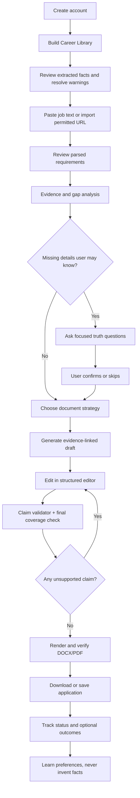
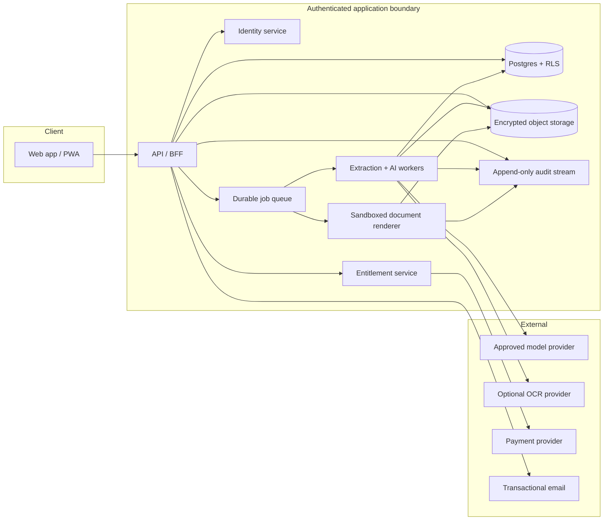
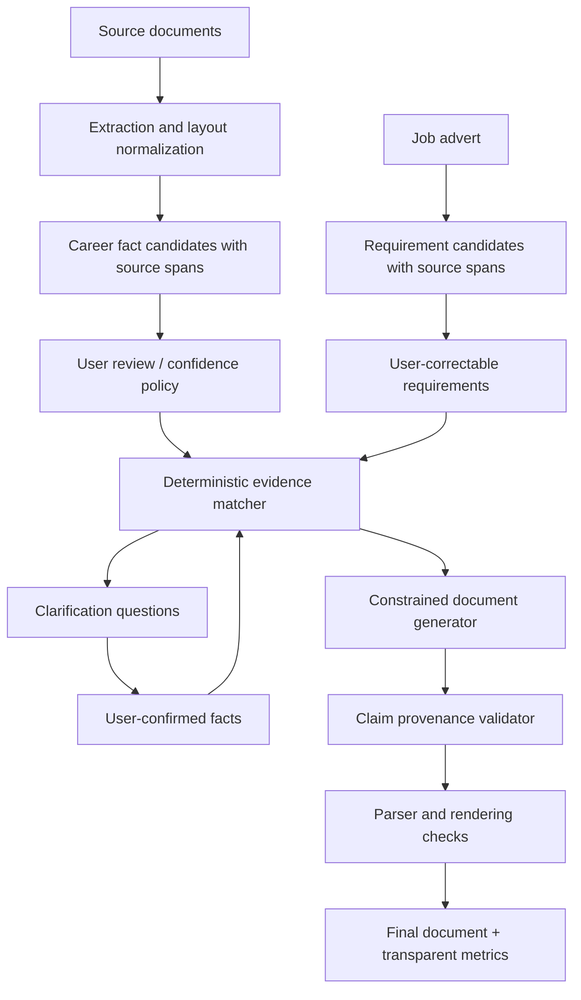

# Better CV Builder — end-to-end product and infrastructure blueprint

Version: 1.0  
Target: “Hello Lily” / platform-portable implementation  
Reference deployment: one Lovable app + external EU Supabase environments + isolated worker

## Platform note

“Hello Lily” does not resolve publicly to one unambiguous application-building platform. The closest public products with that name are unrelated products: an older Django CRM, a WordPress theme, and several AI services. Shortlisted contains high-confidence evidence of Lovable involvement (Lovable client dependencies and OAuth origins), but that does not prove exclusive authorship or current hosting. This specification therefore keeps business logic portable and includes an explicit **Lovable + Supabase** mapping. If Hello Lily is an internal or private builder, map its page, database, server-function, file-storage, scheduled-job, and secret-management primitives to the interfaces below; the domain model and contracts do not change.

## Product promise

> Turn a reviewed, source-grounded career history and a job description into a truthful, job-specific application package designed and tested for machine parseability—with every important claim traceable to evidence.

The product should optimize communication, not manufacture qualifications. It should tell the user when they are missing evidence, invite them to add true details, and preserve a clean distinction between:

- what the source documents say;
- what the user has explicitly confirmed;
- what the job requires;
- what the tailored document communicates;
- what remains a genuine gap.

## Success criteria

### User outcomes

- A first-time user can reach a reviewable tailored CV in under 10 minutes.
- Every generated factual claim can be opened to its source or user confirmation.
- The user can see why a score changed and reproduce it from visible components.
- DOCX and PDF contain the same content in a predictable reading order.
- The product helps users make material improvements without requiring them to become prompt engineers.

### Quality targets

| Metric | Initial target |
|---|---:|
| Supported digital PDF/DOCX extraction success | ≥98% |
| Scanned-document OCR success with readable input | ≥95% |
| Unsupported/low-quality extraction correctly surfaced | ≥99% |
| Factual claim precision in generated documents | ≥99.5% |
| Generated claims with valid provenance | 100% |
| Deterministic score reproducibility | 100% |
| DOCX/PDF parse smoke-test pass rate | ≥99% |
| p95 analysis latency | <30 seconds |
| p95 draft latency | <45 seconds |
| Account deletion workflow completion | ≥99.9% within stated SLA |

“Interview rate” should be an observed product outcome, not a product promise or a component of the match formula.

## Complete user journey



### 1. Account and consent

- Email/password and one or more standard OIDC providers.
- Terms and privacy acknowledgement are versioned independently from optional analytics/marketing consent.
- V1 requires an account before any upload. A future guest mode is a separate security feature requiring an anonymous-session identity, abuse controls, 24-hour expiry, isolated storage, and an atomic ownership-conversion design; it is not implied by this contract.
- Show the exact plan limit at the point of purchase. Do not use “unlimited” if a fair-use or hard cap exists.

### 2. Career Library

The Career Library is the canonical, reusable source—not a single concatenated text field. It includes:

- identity and contact channels;
- roles, employers, dates, locations, responsibilities, achievements, and metrics;
- education, certifications, courses, projects, publications, and volunteering;
- skills, tools, languages, and proficiency;
- preferences such as writing style and section order;
- original documents and source-linked text chunks.

After extraction, show a review inbox:

- conflicts: two sources disagree on a title/date;
- uncertain fields: extraction confidence is low;
- missing dates or employer associations;
- likely duplicates;
- quantification opportunities framed as questions, never completed by the model.

Each fact has a provenance and state:

```text
source_extracted → user_confirmed
source_extracted → user_corrected
user_entered     → user_confirmed
inferred         → cannot be used until user_confirmed
rejected         → excluded from generation
```

Confirmation may update review state in place; a correction never overwrites the
source value. It archives the prior current row and creates the next immutable fact
revision in the same transaction, preserving lineage and historical analyses.

### 3. Job workspace

Prefer pasted text or uploaded job PDF. URL import is a convenience layer that:

- respects the destination's access controls and terms;
- never bypasses login, robots, or anti-bot measures;
- shows the fetched source URL and timestamp;
- strips navigation, tracking, and unrelated page content;
- asks the user to verify the normalized advert before analysis.

Parse the job into source-linked requirements:

- must-have qualifications;
- preferred/merit qualifications;
- responsibilities;
- domain/context signals;
- seniority and scope;
- language/location/work-authorization constraints;
- non-scored submission constraints such as file type, page/word limit, mandatory questions/sections, attachments, method, and deadline;
- culture or style language that should **not** be treated as a hard qualification without explicit wording.

The user can correct requirement type and weight before scoring.

### 4. Analysis

Show four separate concepts instead of one overloaded score:

1. **Career evidence coverage** — how much of the job specification has source-grounded or user-confirmed support in the Career Library.
2. **CV communication coverage** — how much of that supported evidence is visible in the current CV version.
3. **Document parseability** — whether the product's tested parsers can extract text, headings, dates, and contact details in order.
4. **Claim integrity** — whether every factual document claim has valid evidence.

The requirement matrix is the primary view. A score is a summary, never a verdict.

### 5. Clarification

Before generation, ask no more than five high-value questions, for example:

- “The advert asks for budget responsibility. Did any role include this? If yes, what approximate range can you safely state?”
- “You list the tool, but not how you used it. Which role or project demonstrates it?”
- “The advert requires professional Swedish. What proficiency can you truthfully claim?”

Answers create explicit user-confirmed facts. Skipping leaves a transparent gap. The product must never imply that adding a keyword is equivalent to possessing the qualification.

### 6. Strategy selection

Offer controlled choices:

- language and locale;
- one page, two pages, or content-first adaptive length;
- chronological, compact executive, technical, or early-career structure;
- focus areas selected from evidence-backed themes;
- tone and writing density;
- cover letter and outreach-message options.

Strategy affects selection and presentation, not the truth set.

### 7. Structured editor

The editor operates on typed blocks, not one rich-text blob:

- contact header;
- summary;
- skills groups;
- experience entries and bullets;
- education/certification/project blocks;
- optional custom sections.

Each block/claim carries analysis-requirement IDs, career-fact IDs, and any exact job-source spans. The UI can therefore show:

- why the block was included;
- its source evidence;
- uncovered requirements;
- unsupported or ambiguous language;
- duplicate phrases and excessive keyword repetition;
- estimated page impact.

The user can accept, edit, regenerate one block, pin text, restore versions, or exclude a fact. Regeneration must honor pinned content.

### 8. Export

- Generate DOCX and PDF from the same immutable document-version JSON.
- Use selectable single-column templates first; add multi-column layouts only if parser tests pass.
- Run automated extraction on both rendered files and compare normalized content against the source document model.
- Verify heading order, dates, contact details, page count, font embedding, links, and file size.
- If verification fails, block the “Parseability checked” badge and offer a safer fallback template.
- Require the user to approve the exact final version after unresolved claim/gate warnings are shown; no background or automatic submission/export.

### 9. Application tracker

- Draft, ready, applied, follow-up, interview, offer, rejected, withdrawn, archived.
- Job snapshot, document version, submission date, contacts, notes, reminders, and outcome.
- Outcomes are optional and clearly separated from profile facts.
- Never infer protected characteristics or use them to score a candidate.

## Page and component inventory

| Area | Pages | Core components |
|---|---|---|
| Marketing | Home, example, pricing, methodology, security, blog | Hero, verified demo, pricing table, score-method card, trust center |
| Legal | Terms, privacy, cookies, subprocessors, accessibility | Versioned documents, consent controls, data-request form |
| Auth | Sign in, sign up, verify, reset, MFA | OIDC buttons, password form, recovery, session manager |
| Onboarding | Welcome, import, review facts | Upload dropzone, extraction queue, conflict review, progress |
| Career Library | Overview, facts, sources, preferences | Fact editor, source viewer, provenance badge, conflict resolver |
| Job workspace | Job input, requirements, analysis, clarifications | URL/paste form, source viewer, requirement matrix, score explainer |
| Builder | Strategy, editor, preview, validation, versions | Block editor, fact picker, coverage rail, page preview, diff/history |
| Export | File selection, checks, download | Template picker, validation report, DOCX/PDF cards |
| Applications | Board/list/detail | Status controls, reminders, document snapshot, outcomes |
| Billing | Plans, checkout, usage, portal | Entitlement display, invoices, cancellation, exact quotas |
| Account | Security, privacy, sessions, deletion | MFA, session revocation, export archive, deletion workflow |
| Support | Help center, ticket form/history | Categories, diagnostics consent, attachment scrubber |
| Admin | Users, tickets, content, plans, incidents, audit | Role-gated tables, redaction, audit explorer, feature flags |

## Target system architecture



### Bounded services

Keep these as logical modules even if the MVP deploys as one API and a few workers:

| Service | Owns | Must not own |
|---|---|---|
| Identity | sessions, MFA, login providers | CV content |
| Career Library | documents, chunks, facts, conflicts | job outcomes |
| Job Intelligence | job snapshots and requirements | generation prose |
| Match Engine | versioned deterministic scoring | model calls that decide the score |
| Document Builder | strategies, versions, claims, templates | subscription truth |
| Rendering | DOCX/PDF and parse validation | user authorization decisions |
| Application Tracker | application state and outcomes | career facts without confirmation |
| Entitlements | plans, trials, quotas, usage | marketing copy as a source of truth |
| Trust & Privacy | consent, export, retention, deletion, audit | analytics payload content |
| Support/Admin | tickets, redacted diagnostics, operations | unrestricted source-document access |

## Reference deployment: Lovable app + external Supabase

Use one Lovable project for the product application and link its generated repository. For controlled dev/staging/production isolation, connect it to separately managed EU Supabase projects and deploy migrations/functions through CI. Keep worker/renderer infrastructure in a small separate repository because it has a different binary runtime and release boundary. The viable all-in-one alternative is Lovable Cloud, but its region is fixed at project creation and its current environment/payment/repository constraints must be accepted explicitly; `06-build-plan-for-lovable-or-hello-lily.md` compares both paths.

### Frontend

- React + TypeScript using the router/build system actually generated for the project, accessible component primitives, and a tokenized design system. As of this blueprint, new non-Enterprise Lovable apps normally use TanStack Start with SSR; Shortlisted is a legacy Vite/React SPA. Do not replace one router with the other blindly.
- TanStack Query or equivalent for server state; no raw CV text in persistent browser storage.
- Zod-generated types from API schemas.
- A block editor whose state is document JSON; server remains the version authority.
- Signed, short-lived URLs for source preview and exports.

### Supabase

- Auth for email/OIDC/MFA.
- Postgres for the domain model in `03-reference-schema.sql`.
- Private Storage buckets: `career-sources`, `document-renders`, `support-attachments`, short-TTL `privacy-exports`, and short-TTL `billing-webhook-replay` when raw encrypted replay payloads are required.
- Edge Functions as the authenticated BFF for ordinary requests.
- Webhook functions for payments and transactional-email events.
- The included `operations` + outbox/lease functions form the durable MVP queue; dispatch to `pgmq` or a managed queue if scale requires it. The BFF enqueues identifiers transactionally, and database triggers never perform model calls.
- `pg_cron` for retention, expired-upload cleanup, deletion retries, and aggregate maintenance.

### Worker and renderer

Document extraction, OCR, LibreOffice conversion, font handling, and PDF verification need a controlled runtime with binaries and memory beyond a typical edge function. Deploy an isolated container worker (for example, EU-region Cloud Run, Fly, or an equivalent private service) that:

- accepts only signed internal jobs;
- downloads time-limited object URLs;
- scans uploads, validates MIME by content, and enforces size/page limits;
- has no inbound public route other than authenticated health/internal job endpoints;
- renders with pinned fonts and package versions;
- writes results to private storage;
- discards work files after every job.

If Hello Lily supplies equivalent long-running jobs and binary rendering, use them; do not force rendering into the browser merely to stay inside one platform.

### Secrets

- Model, payment, email, OCR, internal-job, export, and versioned deletion-status-token HMAC secrets exist only in server/worker secret stores.
- Public frontend environment variables contain only publishable configuration.
- Rotate secrets, distinguish environments, and never log access tokens or document text.

## Storage model

### Buckets and object keys

```text
career-sources/{user_id}/{source_id}/{sanitized_filename}
document-renders/{user_id}/{document_version_id}/{render_id}.docx
document-renders/{user_id}/{document_version_id}/{render_id}.pdf
support-attachments/{user_id}/{ticket_id}/{attachment_id}
privacy-exports/{user_id}/{export_id}/portable-data.zip
billing-webhook-replay/{provider}/{event_id}.enc
```

- All buckets private.
- Object access requires a signed URL with a short TTL and an authorization check.
- Store a SHA-256 digest, detected MIME, byte size, scan status, extraction version, and retention class.
- Never trust the filename extension.
- Deduplicate only within the same user boundary unless cryptographic/privacy review approves more.

## API surface

Use `/v1` and idempotency keys for any request that creates a job, charge, version, or export.
`07-openapi.yaml` is the machine-readable contract for the core candidate workflow,
including resumable collection/history reads and portable export. The auxiliary
account/profile, consent, support, checkout/portal, webhook, content/admin, URL
import, and internal worker endpoints listed here remain required but are
deliberately outside that core contract.

### Career Library

| Method and path | Purpose |
|---|---|
| `POST /v1/sources/upload-intent` | Validate file metadata and issue private upload URL |
| `POST /v1/sources/{id}/extract` | Enqueue extraction/OCR |
| `GET /v1/sources` | Paginated source collection for reload/resume |
| `GET /v1/sources/{id}` | Extraction state, quality, warnings |
| `GET /v1/sources/{id}/chunks` | Source text with locations for review |
| `GET /v1/facts` | Filtered fact ledger |
| `POST /v1/facts` | Create user-entered fact |
| `PATCH /v1/facts/{id}` | Confirm, correct, reject, or archive fact |
| `POST /v1/fact-conflicts/{id}/resolve` | Resolve competing values |

### Jobs and analysis

| Method and path | Purpose |
|---|---|
| `POST /v1/jobs` | Create job from pasted text or uploaded source |
| `GET /v1/jobs` / `GET /v1/jobs/{id}` | Paginated jobs and one immutable job snapshot |
| `POST /v1/jobs/import-url` | Import a permitted public URL |
| `POST /v1/jobs/{id}/parse` | Enqueue requirement extraction |
| `PATCH /v1/requirements/{id}` | User-correct type, wording, or weight |
| `POST /v1/jobs/{id}/analyses` | Create immutable analysis snapshot |
| `GET /v1/analyses/{id}` | Matrix, evidence, gaps, and exact score object |
| `GET/POST /v1/analyses/{id}/clarifications` | Read or generate focused questions |
| `POST /v1/clarifications/{id}/answer` | Save confirmed fact or skip |

### Documents and export

| Method and path | Purpose |
|---|---|
| `POST /v1/documents` | Create document workspace from analysis |
| `GET /v1/documents` / `GET /v1/documents/{id}` | Reload document workspaces |
| `GET /v1/documents/{id}/versions` | Immutable version history |
| `POST /v1/documents/{id}/versions` | Generate or save a user-edited immutable version |
| `POST /v1/document-versions/{id}/blocks/{key}/regenerate` | Create a new version with one unpinned block regenerated |
| `POST /v1/documents/{id}/versions/{versionId}/restore` | Copy an old version into a new draft |
| `POST /v1/document-versions/{id}/validate` | Validate claims and final coverage |
| `POST /v1/document-versions/{id}/approve` | User approves the exact validated content hash |
| `POST /v1/document-versions/{id}/renders` | Enqueue one DOCX or PDF render; request the other format separately |
| `GET /v1/renders/{id}` | Render and verification state |
| `POST /v1/renders/{id}/download-intent` | Issue authorized short-lived URL |

### Applications, billing, and privacy

| Method and path | Purpose |
|---|---|
| `POST /v1/applications` | Save application against a document version |
| `GET /v1/applications/{id}` | Reload one application with job summary |
| `PATCH /v1/applications/{id}` | Update status, dates, notes |
| `POST /v1/applications/{id}/outcomes` | Record optional outcome |
| `GET /v1/entitlements` | Canonical plan, trial, quota, usage |
| `POST /v1/billing/checkout` | Create payment checkout |
| `POST /v1/billing/portal` | Open payment portal |
| `POST /v1/privacy/exports` | Start a reauthenticated portable data export |
| `GET /v1/privacy/exports/{id}` | Read export progress and expiry |
| `POST /v1/privacy/exports/{id}/download-intent` | Reauthorize and issue one short-lived URL |
| `POST /v1/privacy/deletion` | Create verified deletion request |
| `GET /v1/privacy/deletion/{id}` | Authenticated progress before access revocation |
| `GET /v1/privacy/deletion-status` | Minimal status after revocation using a one-time status token |
| `PUT /v1/consents/{purpose}` | Versioned opt-in/withdrawal |

### Standard async response

```json
{
  "operation_id": "uuid",
  "resource_id": "uuid",
  "state": "queued",
  "poll_after_ms": 1500,
  "trace_id": "opaque-id"
}
```

Operation states are `queued`, `running`, `needs_input`, `succeeded`, `failed_retryable`, `failed_terminal`, and `cancelled`. Every operation has attempts, a lease timeout, an idempotency key, a request hash, a sanitized error code, and a dead-letter path.

The BFF inserts the operation, its outbox event, and—when billable—its usage reservation in one transaction. Idempotency uniqueness is scoped by user + operation type + key; replaying a key with a different request hash is a conflict. Workers claim rows with `FOR UPDATE SKIP LOCKED`, heartbeat a bounded lease, and finish through transition-aware functions. An expired lease is reclaimed until the attempt cap, then dead-lettered. `model_runs` stores provider/model, prompt version and SHA-256, schema version, temperature, output cap, trace ID, tokens, cost, status, and sanitized errors—never CV or job text.

An analysis is assembled in a server-only `building` state: reviewed requirement snapshots, normalized atomic subcriteria, roll-up/atom assessments, and fact links are inserted in one transaction. Sealing computes and stores a deterministic SHA-256 over those normalized children and permits exactly `building → sealed`; triggers reject later child inserts, updates, or direct deletes. Only sealed analyses are owner-readable. A user correction produces a new analysis snapshot rather than mutating history.

## AI and deterministic processing pipeline



### Stage 0: extraction

- Detect native text, image-only pages, tables, columns, headers, and footers.
- Use native parsers first, OCR only where required.
- Preserve page/paragraph/block coordinates and reading order.
- Normalize Unicode and hyphenation without losing the original span.
- Assign extraction-confidence and quality warnings.
- Do not send entire original files to a model when local extraction suffices.

### Stage 1: fact normalization

The model may propose fact candidates, but each candidate must include source chunk IDs and quoted-location offsets. A deterministic validator checks that the evidence spans exist. Low-confidence or derived facts remain unusable until confirmed.

Examples:

- Safe extraction: employer, title, stated dates, named tool.
- Requires careful association: which role a metric belongs to.
- Requires confirmation: inferred seniority, approximate team size, causal business impact, proficiency not explicitly stated.

### Stage 2: job requirement parsing

Each requirement has:

- the normalized statement;
- exact job-ad source span;
- type: eligibility gate, essential, preferred, responsibility, submission constraint, context, or boilerplate;
- importance only from explicit language in the advert; position/order and model confidence do not create extra weight;
- entities/skills and acceptable evidence forms;
- parser confidence;
- user override history.

The model proposes structure. It does not directly assign the final candidate score.

### Stage 3: evidence matching

Use semantic retrieval to find candidate evidence, then a structured model classifier to propose `direct`, `partial`, `adjacent`, `none`, or `unknown` with fact IDs. Retrieval is only a candidate-selection optimization: a missing retrieval hit is `unknown`, never proof of `none`. Eligibility gates and essential requirements receive an exhaustive normalized-fact scan (or a documented high-recall fallback) before `none` is allowed. Compound requirements persist normalized atom IDs/text/weights plus one typed `direct`/`adjacent`/`none`/`unknown` assessment and fact links per atom; `partial` is only the deterministic roll-up. A deterministic service verifies usable citations, applies the scoring formula, and stores matcher/retrieval versions.

### Stage 4: clarification

Rank questions by expected coverage gain × requirement importance × answerability. Questions must ask for facts, not coach the user to say “yes.” A skipped or negative answer is retained as workflow state but does not become a negative career fact.

### Stage 5: generation

The generator receives only selected source-grounded or user-confirmed facts, reviewed analysis requirements/job context, strategy, and template constraints. Each sentence/bullet returns fact IDs and/or exact job-source spans plus analysis-requirement IDs. Unsupported free-form claims are schema-invalid.

### Stage 6: validation

- Entailment check: does each claim stay within its cited facts?
- Numeric check: all numbers, dates, percentages, currencies, and team sizes match evidence exactly or are explicitly confirmed.
- Entity check: employer, title, product, certification, and school names match canonical values.
- Temporal check: dates and ordering are consistent.
- Requirement coverage: recompute what the final document communicates.
- Style check: readability, repetition, density, weak verbs, and unsupported superlatives.

A failed integrity check blocks export or requires explicit user correction; “regenerate until the validator happens to pass” is not sufficient without tracing the root cause.

## Scoring specification

### Requirement-level evidence value

| Evidence state | Value | Definition |
|---|---:|---|
| Direct | 1.0 | Usable source-grounded or user-confirmed facts explicitly demonstrate the requirement |
| Partial | Derived range | Decompose the compound requirement into reviewed atomic subcriteria; never assign automatic half-credit |
| Adjacent | 0.0 for category coverage | Transferable evidence only; reported separately |
| Unknown | range | The profile may be incomplete; lower bound uses 0 and upper bound uses 1 |
| None | 0.0 | The user has confirmed no usable evidence, or exhaustive/high-recall fallback review found none |

Requirements are atomic where practical. Explicit alternatives remain alternatives rather than separate mandatory atoms. A compound roll-up is “partial” when only some atoms are directly supported; its value is the weighted mean of the visible atomic states. If safe decomposition is not possible, partial remains a 0–1 uncertainty range until user review.

Within each requirement class:

```text
coverage = Σ(requirement_weight × evidence_value) / Σ(requirement_weight)
```

Eligibility/legal gates are reported separately as `met`, `not_met`, or `unknown` and are never averaged. Essential, responsibility, and preferred requirements each get their own coverage range. Requirements are equal-weighted within a category unless the advert explicitly gives one more importance.

If stakeholders insist on a single summary, a proposed—not research-derived—default is a transparent 70/20/10 scheme:

```text
career_coverage = 100 × (
    active_essential_weight × essential_coverage
  + active_responsibility_weight × responsibility_coverage
  + active_preferred_weight × preferred_coverage
)
```

Default weights are 0.70, 0.20, and 0.10. If a category is genuinely absent, redistribute its weight proportionally across present categories and show the effective weights. The lower-bound score treats unknowns as 0 and the upper bound treats them as 1—for example, “62–78 until two items are confirmed.” Transferable evidence remains a separate coaching view and never changes a missing requirement to “met.”

Hard constraints such as a legally required license can be shown as unresolved gates. Do not silently cap or alter the number; display both the numerical coverage and the gate state.

### One canonical score object

```json
{
  "score_version": "coverage-1.0.0",
  "components": {
    "essential": { "lower": 0.78, "upper": 0.88, "configured_weight": 0.70, "effective_weight": 0.70 },
    "responsibility": { "lower": 0.60, "upper": 0.75, "configured_weight": 0.20, "effective_weight": 0.20 },
    "preferred": { "lower": 0.40, "upper": 0.40, "configured_weight": 0.10, "effective_weight": 0.10 }
  },
  "unrounded_lower": 70.6,
  "unrounded_upper": 80.6,
  "display_lower": 71,
  "display_upper": 81,
  "gates": [{ "analysis_requirement_id": "uuid", "state": "unknown" }],
  "requirement_snapshot_hash": "64-hex-digest",
  "fact_snapshot_hash": "64-hex-digest"
}
```

The API, headline, breakdown, label, analytics, and stored record all consume this exact object. Models never emit or modify the numerical fields. Once all unknowns are resolved, lower and upper are identical.

### CV communication coverage

Run the same matcher against claims actually present in the selected CV version. Show a transition such as:

```text
Grounded eligible career evidence: 75
Evidence communicated in original CV: 54
Evidence communicated in tailored CV: 71
Unresolved genuine gaps: 3
```

This is a defensible way to demonstrate product value. It does not pretend the candidate became more qualified or that an interview is guaranteed.

## Learning system

The system learns **presentation preferences and observed workflow outcomes**, never new career facts without confirmation.

### Learn immediately for the same user

- preferred spelling, locale, tone, length, and section order;
- phrases or blocks the user pins;
- whether the user tends to accept concise or detailed bullets;
- repeated rejection of a style pattern;
- template and export preferences.

### Require explicit confirmation

- new skills, metrics, dates, titles, responsibilities, seniority, certifications, language levels, and business outcomes;
- any attempt to generalize a fact from one role to another;
- any model-inferred relationship between facts.

### Events to collect

```text
suggestion_shown
suggestion_accepted
suggestion_edited
suggestion_rejected
block_pinned
fact_confirmed
fact_corrected
validation_failed
render_downloaded
application_status_changed
outcome_recorded
```

Store identifiers and structured deltas by default, not duplicate document text in analytics. Pooled/model-training use is off by default and requires a separately documented purpose, legal basis, explicit opt-in where relied on, de-identification, withdrawal/deletion propagation, and a retraining/unlearning policy; consent language alone does not settle every GDPR obligation.

### Evaluation metrics

- suggestion acceptance and edit distance by block type;
- unsupported-claim rate and numeric-error rate;
- extraction correction rate by format/parser version;
- requirement coverage before and after tailoring;
- parse-test pass rate by template/version;
- time to first valid export;
- user-reported usefulness;
- optional funnel outcomes with cohort and selection-bias caveats.

Interview/offer outcomes are noisy: job market, candidate behavior, employer decisions, and who chooses to report all confound them. Use them to form hypotheses, not to claim causal uplift without a proper experiment.

## Privacy, security, and trust

### Data classification

| Class | Examples | Controls |
|---|---|---|
| Restricted | CV source text, contact data, generated documents, job analyses, application notes | encryption, RLS, private storage, redacted logs, least privilege |
| Confidential | support content without CV/application material | RLS, private storage, retention controls |
| Internal | aggregate cost/latency metrics | no content or direct identifiers |
| Public | published blog/help content | CMS roles, review workflow |

### Compliance governance

- Maintain a processing inventory and purpose/legal-basis/retention matrix for account delivery, file extraction, AI inference, billing, support, security, product analytics, marketing, outcome research, and any model improvement.
- Complete documented DPIA screening before launch and repeat it when scale, providers, data categories, automated evaluation, or employer-facing scope changes. A consumer drafting assistant is not automatically the same as an employer recruitment-ranking system; adding employer filtering/ranking/evaluation can materially change obligations under the EU AI Act and employment law.
- Minimize and do not infer special-category data. A server-owned classifier assigns sensitivity and permitted-purpose flags to every fact; user clients cannot relax them. If uploaded content can reveal health, ethnicity, religion, politics, union membership, sexual orientation, or biometrics, quarantine the fact with no matching/generation purpose by default, minimize or redact provider input, document the Article 9 analysis, and exclude it from matching, generation decisions, analytics, and training unless a separately approved purpose permits otherwise. Analyses and generated documents inherit the highest applicable upstream classification; derivation never downgrades sensitivity.
- Publish an accurate subprocessor register with legal entity, purpose, data categories, location, retention, transfer mechanism, and change process; execute processor terms and transfer safeguards through the chain.
- Support access, portable export, rectification, erasure, consent withdrawal, and objection/restriction where applicable. Do not promise a legal basis or deadline that operations cannot meet.
- Treat this section as engineering requirements, not legal advice; Swedish/EU counsel should review the real processing and consumer terms before launch.

### Authorization

- RLS on every user-bearing table; deny by default.
- Authorization derives user ID from the verified session, never a client-supplied body field.
- Service-role credentials only in trusted workers; worker methods validate signed job scope.
- Admin uses separate roles, MFA, reason capture, and append-only audit events.
- Support staff see redacted metadata by default and need time-limited elevation for content access.

### Upload defenses

- size/page/type limits before upload completion;
- MIME/magic-byte validation;
- malware scanning and archive-bomb protection;
- sanitized filenames and isolated conversion;
- no macros or active content execution;
- extraction timeouts and per-user concurrency limits.

### Model-provider controls

- documented subprocessors and processing regions;
- Production gate: service inputs are contractually excluded from provider training/model improvement; retention is explicitly configured and documented; processing regions and subprocessors are approved. If a provider cannot meet the approved controls, do not send CV data to it.
- send the minimum chunks required for the stage;
- redact contact information from job matching when not required;
- no provider API calls from the browser;
- prompt-injection defenses: source documents and job adverts are untrusted data, never instructions.

### Consent and analytics

- Essential authentication/security storage can operate without optional consent.
- Do not load marketing or behavior-replay scripts until valid opt-in where required.
- Make withdrawal as easy as acceptance and preserve a versioned consent receipt.
- Disable session replay on authenticated CV/application pages; masking is not a substitute for minimization.
- Product analytics use a first-party, content-free event schema.

### Retention and deletion

Define and display retention by object class. Suggested defaults:

| Data | Default |
|---|---|
| Abandoned incomplete uploads | 24 hours |
| Failed temporary extraction artifacts | 24 hours |
| Career-source originals | Offer “keep in Career Library”; otherwise delete within 24 hours after successful extraction/review |
| Extracted chunks and confirmed facts | Retain for the active Career Library until user deletion or configured inactivity policy |
| Export binaries | 30 days, regenerable from retained version |
| Active account domain data | Until user deletion or configured inactivity policy |
| Security audit records | Fixed justified period, pseudonymized where possible |
| Payment records | Required statutory/contractual period, segregated |

Deletion is a durable state machine:

```text
requested → identity_reverified → access_revoked → deleting
→ awaiting_backup_expiry → completed
```

The `deleting` state owns idempotent checklist steps for domain rows, storage objects, processors, analytics identifiers, and export files. Give the user a request ID, effective access-revocation time, expected backup expiry, failure escalation, and a **status token** whose hash is stored server-side. To make the original POST safely replayable without storing that token, derive it from the deletion ID with a versioned server HMAC key and retain that key until every dependent request completes. Send the token only in the response/header—never a URL—and use it for a rate-limited, content-free status endpoint after login is revoked. At completion, issue a separate content-free receipt stating access-revocation, domain-deletion, and backup-expiry times; systems covered; policy version; and any segregated billing/legal categories retained with their schedules. Payment/legal records that must remain are disclosed, pseudonymized where possible, segregated, and deleted on their own justified schedule.

### Secure development

- threat model uploads, prompt injection, IDOR/RLS mistakes, admin access, export URLs, webhooks, and payment replay;
- dependency and secret scanning in CI;
- signed webhook verification and replay prevention;
- content security policy, secure cookies, CSRF protection where relevant, rate limiting, and bot defense;
- annual penetration test plus tests after material authorization changes;
- documented incident response and user-notification playbook.

## Billing and entitlements

Create one canonical plan catalogue:

```json
{
  "plan_code": "pro_monthly_v1",
  "billing_period": "month",
  "amount_minor": 27000,
  "currency": "SEK",
  "trial_days": 7,
  "limits": {
    "analyses_per_24h": 50,
    "generations_per_24h": 20,
    "renders_per_24h": 40,
    "ocr_pages_per_24h": 200,
    "active_sources": 50
  }
}
```

Pricing UI, checkout metadata, webhook handling, entitlement checks, usage meters, receipts, and terms all render from the same versioned catalogue. `-1` is the only explicit unlimited meter value. Webhooks are authoritative for payment state: verify signatures against raw bytes, deduplicate by provider + event ID, tolerate reordering, and reconcile periodically rather than trusting a checkout redirect.

For a billable operation, reserve usage atomically before queue acceptance, consume the reservation on successful product work, and release it only on terminal infrastructure failure—not on a truthful low match or a user cancellation after work was delivered. Keep normalized subscription history for the separately justified accounting/contract period. If encrypted raw webhook payloads are retained for replay, give them a short explicit TTL and purge them independently from normalized history.

## Observability

### Content-free telemetry

- request/trace/job IDs;
- route/function/model/parser/template versions;
- latency, queue wait, attempt count;
- input/output token counts and cost;
- status and sanitized error codes;
- document format, page count, and extraction quality bands;
- requirement/fact/claim counts—not the text;
- validation error categories;
- entitlement decisions.

### SLOs and alerts

- API availability and p95 latency;
- queue age and dead-letter rate;
- extraction/generation/render success;
- claim-integrity failure spikes;
- model JSON/schema failure;
- RLS/authorization denials and anomalous admin activity;
- webhook lag and subscription divergence;
- deletion jobs exceeding SLA;
- spend per successful export.

Logs must be redacted by construction. A “do not log these fields” convention is insufficient; use typed log functions that accept only approved metadata.

## Failure handling

| Failure | User experience | System behavior |
|---|---|---|
| Image-only PDF | “This file needs OCR” with progress | OCR job; retain page coordinates |
| Password-protected file | Clear unlock/re-export instructions | No repeated parser retries |
| Unsupported/corrupt DOCX | Explain conversion options | Quarantine temp file; terminal code |
| Job URL blocked | Ask user to paste text | No bypass attempts |
| Low-confidence fact | Review inbox | Excluded from generation until confirmed |
| Model timeout | Preserve state and retry safely | Idempotent retry with capped backoff |
| Invalid model JSON | No partial save | Schema-repair attempt, then model fallback/dead letter |
| Unsupported claim | Highlight exact block | Block export until corrected/removed |
| Render mismatch | Offer safe fallback template | Store failed verification report |
| Payment webhook delayed | Show pending state | Reconcile; never trust redirect alone |
| Quota race | Stable entitlement message | Atomic counter/lease |
| Deletion partial failure | Request remains visible as in progress | Retry, alert, auditable per-system steps |

## Testing strategy

### Unit

- score formula, rounding, weight redistribution, gates;
- claim/fact eligibility rules;
- date/number/entity validators;
- entitlement and quota transitions;
- retention and deletion state transitions.

### Contract

- every AI response against strict JSON Schema;
- API/OpenAPI compatibility;
- payment/email/OCR provider fixtures;
- renderer-to-parser round trips.

### Integration

- RLS tests for owner, different user, support, admin, and anonymous roles;
- signed URL scope and expiry;
- queue retry/idempotency/dead-letter behavior;
- webhook ordering, duplication, and signature failures;
- deletion across tables, storage, exports, analytics identifiers, and processors.

### Golden-set AI evaluation

Build a consented or synthetic corpus with:

- Swedish and English CVs/jobs;
- digital PDF, DOCX, scanned PDF, tables, columns, headers, and images;
- overlapping employers/titles and conflicting dates;
- explicit gaps and tempting but unsupported inferences;
- multiple career levels and sectors.

Human labels cover source facts, job requirements, evidence links, acceptable paraphrases, prohibited claims, and expected deterministic scores. Run the suite on every prompt/model/parser change and gate releases on non-regression.

### End-to-end

1. account creation and consent choice;
2. upload → scan → extract → fact review;
3. job parse → requirement correction → analysis;
4. clarification → confirmed fact → score recompute;
5. generate → edit → validate → DOCX/PDF;
6. parse rendered files and compare content/order;
7. save application and update outcome;
8. plan upgrade/downgrade/cancel and quota boundaries;
9. export account data and complete deletion;
10. keyboard-only and screen-reader critical paths.

## Delivery phases

### Phase 0 — foundations (1–2 weeks)

- finalize truth/provenance model, threat model, data inventory, plan catalogue, and evaluation corpus;
- set environments, migrations, CI/CD, secret management, RLS test harness, error taxonomy, and observability;
- prototype extraction and server rendering before committing to product scope.

### Phase 1 — trustworthy MVP (4–6 weeks)

- auth/consent, Career Library, PDF/DOCX extraction, fact review;
- pasted job descriptions and requirement review;
- deterministic evidence matrix and transparent score;
- focused clarification questions;
- structured CV generation/editing with one safe template;
- provenance validation and verified DOCX/PDF;
- basic plan/entitlement, data export, deletion, and support.

### Phase 2 — complete application workflow (3–5 weeks)

- cover letter and outreach message;
- multiple verified templates and version comparison;
- application tracker, reminders, outcomes;
- permitted URL import;
- subscription self-service, content/help center, admin/audit tools;
- Swedish/English golden-set expansion and accessibility audit.

### Phase 3 — learning and optimization (ongoing)

- preference learning from accepted edits and pinned blocks;
- experiment framework and consented aggregate outcomes;
- domain-specific requirement taxonomies;
- model routing for quality/cost/latency;
- team/coaching features only after tenant isolation is designed.

## Release gates

Do not launch paid generation until all are true:

- 100% of generated candidate-history claims carry valid fact IDs, job/company-context claims carry exact job-source spans, and mixed claims carry both;
- the score shown everywhere is byte-for-byte derived from one score object;
- generated DOCX and PDF pass extraction/order comparison;
- the user has approved the exact validated document hash before final rendering/export;
- cross-user RLS and signed-URL tests pass;
- optional trackers do not load before valid consent;
- plan language and enforced quotas match;
- account export and deletion complete in staging across every deletable store, with separately scheduled retained billing/legal records verified against disclosure;
- privacy/subprocessor/retention disclosures match actual runtime behavior;
- the unsupported-claim golden set meets the target precision;
- support can diagnose failures without reading raw CV content by default.

## Build-vs-buy choices

| Capability | Recommendation |
|---|---|
| Identity, Postgres, private object storage | Managed platform such as Supabase |
| Payment | Stripe or equivalent; never build card handling |
| Email | Transactional provider with EU/DPA assessment |
| PDF/DOCX parsing | Proven libraries plus an isolated worker |
| OCR | Managed provider or controlled open-source engine based on region/cost |
| AI inference | Provider abstraction with strict contracts and evaluation |
| Deterministic scoring/validation | Build and own; this is product trust logic |
| Document data model and provenance | Build and own; this is the core moat |
| Rendering | Own the templates; use pinned open-source/managed rendering runtime |
| Analytics | First-party content-free events; optional external tools only after consent |

## Definition of “better than Shortlisted”

The replacement is better when it can demonstrate all of the following, not merely produce nicer prose:

- the score is reproducible and never internally contradictory;
- the final CV is measured, not just the source profile;
- each claim is traceable and unsupported claims cannot silently ship;
- missing information becomes an honest question rather than a hallucination;
- both Word and PDF are generated and parser-verified;
- the user edits structured content and can understand why it was selected;
- learning improves preference fit without rewriting career history;
- deletion, consent, quotas, and provider disclosures work exactly as described;
- outcome language is honest: coverage and communication, not fabricated interview probability.
