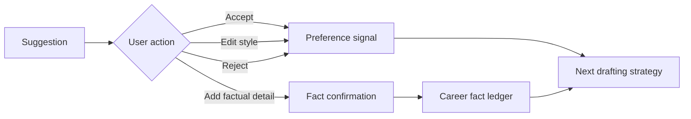

# What a strong CV-tailoring system should learn

This report combines the controlled Shortlisted workflow, official CV guidance, documented ATS parser behavior, and a product-learning design. It distinguishes durable writing lessons from proposed software decisions.

## The central lesson

A tailored CV does not make a person more qualified. It makes relevant, already-true evidence easier to find and understand.

That distinction gives the product an honest measurement model:

```text
career evidence coverage     = what the user can truthfully demonstrate
CV communication coverage   = what the selected CV actually communicates
parseability                 = what software can reliably extract from the file
human quality                = clarity, relevance, credibility, and readability
```

Do not collapse these into a universal “ATS score.” Applicant-tracking products parse and search documents differently. Greenhouse documents formatting failures and says partial parses need manual correction/verification; Lever documents accepted formats, the selectable-text heuristic, and manual entry when parsing fails. Neither linked page supports the claim that one public score predicts all ATS behavior. See [Greenhouse parser guidance](https://support.greenhouse.io/hc/en-us/articles/200989175-Unsuccessful-resume-parse) and [Lever parser guidance](https://help.lever.co/hc/en-us/articles/20087345054749-Understanding-resume-parsing).

## Lessons from reading a CV against a job advert

### 1. Parse the advert before touching the CV

A good review first separates:

- explicit eligibility gates;
- essential/minimum criteria;
- responsibilities and intended outcomes;
- preferred/desirable criteria;
- domain/seniority context;
- company, EEO, accessibility, and application boilerplate.

Responsibilities are not automatically minimum qualifications. “You will lead quarterly planning” and “five years of planning experience is required” mean different things. The parser must keep the exact source wording and let the user correct the category. This follows the broader job-analysis principle that tasks and competencies should be explicitly connected, rather than inferred from vague impressions; see the [US Office of Personnel Management’s job-analysis guidance](https://www.opm.gov/policy-data-oversight/assessment-and-selection/job-analysis/).

### 2. Read evidence, not keywords

A term appearing in both documents is useful retrieval evidence, but it is not proof of capability. For each requirement ask:

1. Where is the strongest source evidence?
2. Does it demonstrate the whole requirement or only part?
3. Is it from the relevant role/project and time period?
4. Are scope, outcome, and level explicit or merely plausible?
5. Could the user defend the proposed wording in an interview?

Oxford’s guidance emphasizes demonstrating job criteria with evidence, and MIT recommends accomplishment-oriented writing that connects a problem/project, action, and result: [Oxford criteria guidance](https://www.careers.ox.ac.uk/demonstrate-you-fit-the-job-criteria) and [MIT resume guidance](https://capd.mit.edu/resources/resumes-writing-about-your-skills/).

### 3. Unknown is not the same as absent

If the advert asks for budget ownership and the uploaded CV says nothing about budgets, the tool knows only that the current library lacks evidence. It does not know whether the user lacks the experience.

The honest state is `unknown`, followed by a focused question. A coverage range such as “62–78% until two details are confirmed” communicates uncertainty better than silently scoring both as failures.

### 4. Preserve the relationship between facts

Models often create subtle falsehoods by recombining true fragments:

- a metric from one role moves to another;
- participation becomes ownership;
- a team that the user coordinated becomes a team they managed;
- use of a tool becomes implementation expertise;
- a company outcome becomes an individual causal claim.

Facts therefore need role/project associations, dates, and source spans—not just a bag of extracted sentences.

### 5. Separate direct and transferable evidence

Adjacent experience can support positioning, but it must not disguise a gap. For example, using one CRM platform may show transferable implementation experience for another platform; it does not prove product-specific certification or years of hands-on use.

A good matrix shows:

- direct evidence;
- partial evidence and the missing part;
- transferable evidence with a plain-language caveat;
- no evidence;
- unknown, where a question could resolve it.

### 6. Treat taxonomies as helpers, not as the advert

O*NET and ESCO can normalize skill names and suggest related concepts, but the employer’s wording remains the source of truth. Any synonym or transferable-skill expansion should be visible and reviewable. See [O*NET’s content model](https://www.onetcenter.org/content.html) and the [ESCO API overview](https://esco.ec.europa.eu/en/about-esco/escopedia/escopedia/esco-api).

## Lessons for adjusting the CV

### 1. Tailoring is mostly selection, order, and clarity

The safest high-value changes are:

- select the most relevant evidence;
- move relevant bullets earlier within the correct role;
- shorten low-relevance detail;
- use the advert’s exact term when it accurately describes the evidence;
- make the action/context/result relationship clearer;
- expand an acronym once;
- create a short role-specific summary from supported facts;
- group skills so important, evidenced terms are easy to scan.

Europass explicitly distinguishes a reusable master profile from the CV selected and tailored for a particular application, and recommends focusing on facts relevant to the vacancy: [Europass profile vs CV](https://europass.europa.eu/en/what-difference-between-europass-profile-and-cv) and [Europass CV guidance](https://europass.europa.eu/en/create-europass-cv).

### 2. Quantify only from evidence

Numbers make evidence concrete, but a plausible number is still false if the source or user does not support it. The system should ask for a defensible number or range and accept “I don’t know.” It must never invent percentages, budget sizes, team sizes, revenue, time savings, volumes, or years.

### 3. Preserve official titles and credentials

An official title can be supplemented by an approved plain-language parenthetical, but it should not be silently upgraded. The same applies to degree names, certifications, language levels, and licenses.

### 4. Do not “fix” a genuine requirement gap with prose

If a license, language level, or product-specific qualification is absent, mention relevant transferable evidence only where helpful and leave the gap visible. The purpose is to improve a truthful application, not manufacture eligibility.

### 5. Re-score the final document, not only the profile

The source profile may support a requirement that the final one-page CV omits. Conversely, generation may introduce a keyword while weakening the actual evidence. The final structured document must be checked again so the product can show:

```text
original CV communication coverage → tailored CV communication coverage
```

The controlled Shortlisted test did not visibly do this; it analyzed the source profile and then generated a CV without a transparent post-generation matrix.

### 6. Optimize for two readers

The document must survive machine extraction and remain useful to a person. Safe defaults from documented parser behavior are:

- one column;
- standard localized headings;
- DOCX or a text-based PDF;
- no essential information in headers/footers;
- no photos, graphics, text boxes, or complex tables;
- consistent dates and explicit titles;
- readable typography and restrained bullets;
- selectable text and a conservative file size.

Greenhouse documents failures involving image documents, graphics, columns, tables, text boxes, headers/footers, unclear sectioning, and incomplete titles. Lever’s practical advice is to check whether the text is selectable; image formats are not parsed as resumes. The employer’s requested format always wins.

### 7. Round-trip the export

After rendering DOCX and PDF, extract their text again and compare it with the structured document model. Check:

- name/contact fields;
- headings and reading order;
- employers, roles, and dates;
- bullet order and punctuation;
- character/glyph integrity;
- page count and file size.

Call this a **parseability check**, not “ATS-proof.”

## A synthetic adjustment example

Job requirement:

> Lead a cross-functional CRM implementation and improve commercial workflows.

Career evidence:

```text
Fact A: Coordinated a five-person working group during a Salesforce migration.
Fact B: The migration reduced lead-response time by 18%.
Fact C: The user has not stated that they were the line manager.
```

Weak adjustment:

```text
Managed a five-person team and increased conversion by 18% through Salesforce.
```

Why it fails: “managed,” “conversion,” and the causal relationship are not in the evidence.

Grounded adjustment:

```text
Coordinated a five-person cross-functional working group during a Salesforce
migration that reduced lead-response time by 18%.
```

Why it works: it uses the job’s relevant concept, preserves the documented role and metric, and does not convert coordination into line management or response time into conversion.

## What the product should learn from edits

The system can safely learn **how the user likes true facts presented**:

- preferred length, density, locale, and tone;
- section order and template choice;
- accepted/rejected verb and sentence patterns;
- phrases and blocks the user pins;
- whether they prefer concise or detailed evidence.

An accept/reject/edit click is not automatically a stable preference. Rejection may mean “factually wrong,” “wrong for this job,” “too long today,” or “not my style.” Capture an optional reason and job/block context, treat implicit signals as provisional, decay weak/old signals, and let the user inspect, undo, reset, and export learned preferences. Explicit preferences outrank inferred ones.

It must not learn a new career fact merely because the user edited a sentence. A factual edit—new metric, role, title, date, skill, credential, proficiency, scope, or result—enters a confirmation flow and the fact ledger separately.

Keep three logical stores:

```text
authoritative career facts  ≠  writing preferences  ≠  outcome telemetry
```

Per-user preference learning is the default. CVs, edits, preferences, and outcomes do not enter pooled product/model training without a separately documented purpose and lawful basis, transparent granular opt-in, provider controls, withdrawal/reset/export, and deletion cascading to training queues/corpora where technically and legally applicable. Outcome reporting remains optional. Logical separation is an architecture control, not by itself proof of GDPR compliance.

### Learning event loop



### What outcomes can and cannot teach

Application, screening, interview, and offer outcomes may help identify patterns, but they are confounded by employer decisions, timing, the market, geography, networking, referrals, user behavior, and selective reporting. Report them as observational correlations with uncertainty. Do not turn them into a “candidate quality” label or claim causal uplift without a credible controlled experiment.

## Bias and fairness lessons

- Exclude name, photo, address/postcode, age/birth date, pronouns, and nationality from requirement matching. Any proposed protected/proxy-field exception requires documented human/legal review; the model cannot decide legality. Keep nationality distinct from a user-confirmed work-authorization or availability fact that an explicit lawful gate genuinely requires. Identity fields can still be rendered where appropriate without entering the scorer.
- Never infer disability, ethnicity, religion, health, pregnancy/parental status, sexuality, or union membership.
- Do not penalize career gaps, nontraditional paths, foreign/nonstandard titles, or prestige signals. If the advert explicitly asks for a named credential, assess only whether that credential is evidenced; never score the prestige of a school or employer.
- Counterfactual copies with altered names, pronouns, ages, or gap phrasing must produce the same fact-to-requirement score. Invariance is necessary but not proof of fairness: the job criteria, labels, extraction quality, and generated language can still encode bias.
- Evaluate extraction and matching by language, career level, non-degree routes, career changes, gaps, and title conventions.

Sweden’s Equality Ombudsman warns that historical data can reproduce existing inequality and that apparently neutral AI may be over-trusted. Its employer-responsibility point applies when a system is deployed by or for employers in recruitment. A candidate-side drafting assistant is not automatically an EU AI Act Annex III recruitment system; expanding into employer-side filtering, ranking, or candidate evaluation may be high-risk and requires specialist review. See [DO’s report on AI and discrimination at work](https://www.do.se/rattsfall-beslut-lagar-stodmaterial/publikationer/2023/ai-och-risker-for-diskriminering-i-arbetslivet) and the [EU AI Act](https://eur-lex.europa.eu/eli/reg/2024/1689/oj).

If protected-group data is ever collected for fairness auditing, keep it voluntary and separate from product scoring/generation, apply strict access controls and retention, and document the GDPR—including Article 9 where applicable—analysis. Report slice metrics with sample sizes and uncertainty.

## Three review gates that should remain human

These approvals are required before export; only their presentation and batching may be streamlined.

1. **Requirements:** confirm what the advert actually requires.
2. **Claims:** approve changed/generated claims with their cited evidence; resolve conflicts and unsupported fragments.
3. **Final file:** review facts, readability, plain-text parse preview, and change log before export.

Harvard’s career guidance frames AI output as a starting point that still needs authenticity, personalization, and proofreading: [Harvard AI/resume guidance](https://careerservices.fas.harvard.edu/ai-resumes-and-cover-letters/). Arbetsförmedlingen likewise emphasizes adapting the CV to the role and making relevant competence easy to understand: [Arbetsförmedlingen CV guidance](https://arbetsformedlingen.se/for-arbetssokande/cv-ansokan-och-intervju/skriva-cv).

## Metrics for continuous improvement

### Truth and extraction

- unsupported-claim rate;
- numeric/date/title preservation;
- source-citation accuracy;
- extraction correction rate by parser, format, and language;
- conflict-detection recall.

### Relevance and writing

- requirement evidence precision/recall;
- communication coverage before/after;
- suggestion acceptance, rejection, and edit distance;
- time to approved draft;
- blind reviewer preference and factual-correction rate.

### Parseability

- selectable-text pass;
- heading/contact/date/content retention after round trip;
- reading-order agreement;
- file-size/page-count pass;
- results by DOCX/PDF, template, and locale.

### Fairness and trust

- counterfactual score invariance;
- error-rate differences by evaluated slice with sample sizes/uncertainty;
- user corrections to seniority/agency language;
- consent/withdrawal success;
- user-data deletion and processor acknowledgement completion.

### Outcomes

- optional application → screen → interview → offer funnel;
- confidence intervals and missingness/opt-in rate;
- experiment results clearly separated from observational reporting.

Proposed numeric targets, formula weights, and retention periods in the architecture are product choices to validate. The source-backed constraints are truthful evidence, criteria-specific tailoring, human review, simple parseable formatting, privacy/security, and caution about automated inference.
