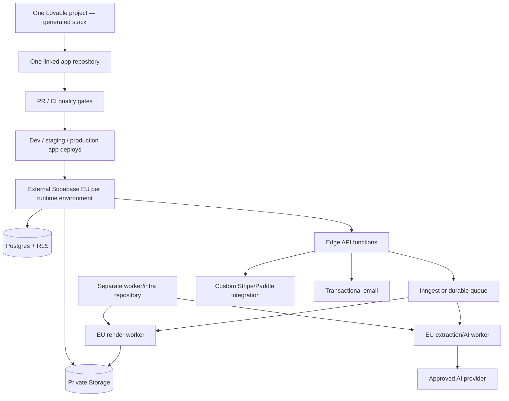

# Build plan for Lovable—or an equivalent “Hello Lily” platform

## Platform decision

The strongest evidence establishes **Lovable involvement** in Shortlisted: its deployed JavaScript references Lovable authentication origins and `@lovable.dev/cloud-auth-js` alongside Supabase. That makes a Lovable-built/integrated application highly likely, but client artifacts alone do not prove who generated the code or which provider hosts the frontend. I could not identify a current public app builder whose exact name is “Hello Lily”; similarly named public products are unrelated. Shortlisted is a legacy React/Vite application, while Lovable's current FAQ says new non-Enterprise apps created from 13 May 2026 use TanStack Start with SSR. Inspect the project Lovable creates instead of hard-coding the old stack: [Lovable FAQ](https://docs.lovable.dev/introduction/faq), [Cloud](https://docs.lovable.dev/integrations/cloud), and [GitHub sync](https://docs.lovable.dev/integrations/github).

This build plan therefore uses Lovable as the concrete frontend/application builder. If “Hello Lily” is a separate private platform, use the capability test below. If a capability is missing, keep that service outside the builder rather than weakening the architecture.

### Current Lovable constraints to design around

These are vendor facts current on the report date, not guarantees of future limits:

| Area | Documented behavior | Design response |
|---|---|---|
| Generated stack | New non-Enterprise apps from 13 May 2026 use TanStack Start + SSR; older apps such as Shortlisted use React + Vite | Preserve the generated stack/router and branch implementation guidance by actual project |
| Region | Americas, Europe, or Asia Pacific; a Cloud project's region cannot later be changed | Select Europe before enabling production Cloud |
| Backups | Daily database backups with roughly 14 days visible retention | Add independent recovery/export policy and rehearse restore |
| New-project environments | Lovable Cloud's Test/Live beta closed to new projects on 24 March 2026 | Do not assume native staging; use externally managed runtime environments or preplanned separate projects/manual promotion |
| Cloud export/migration | Database export is separate from Storage; user passwords, auth providers, files, and secrets require manual migration; documented DB export limit is 5 GB and one request/24h | Git-sync code, separately inventory/migrate objects and auth, plan password resets, and rehearse migration before onboarding |
| Storage | Buckets are private by default; platform maximum is documented as 2 GB/file | Enforce a much lower CV limit such as 10 MB plus page/pixel limits |
| Secrets | Backend Secrets are write-only; `VITE_` values are browser-exposed build values | Keep model/payment/service keys server-side; permit only publishable config in `VITE_` |
| Git | One Lovable project links to a newly created repository and syncs one active branch; existing-repository import is unsupported | Connect immediately, keep the generated app at repo root, use PR/CI, and keep workers/infra in a separate repo |
| Async work | Edge Functions suit request-bound work; the Inngest connector supports slow/retriable pipelines using the customer's Inngest account/keys | Separate staging/production queues and put extraction/OCR/AI/render pipelines there |
| Payments | Built-in Stripe/Paddle requires Lovable Cloud, auto-manages keys/webhooks, permits one provider/project, and cannot be combined with an external Supabase project | Choose built-in Cloud payments **or** custom provider integration; never mix the two paths |
| Usage | Cloud, AI, compute, network, storage, and realtime consume usage credits; exact workload cost varies | Budget and alert on cost per successful validated export |

Sources: [Lovable Cloud](https://docs.lovable.dev/integrations/cloud), [environments](https://docs.lovable.dev/features/environments), [GitHub sync](https://docs.lovable.dev/integrations/github), [external deployment/migration](https://docs.lovable.dev/tips-tricks/external-deployment-hosting), [payments](https://docs.lovable.dev/features/payments), and [Inngest](https://docs.lovable.dev/integrations/inngest).

## Capability test for any builder

| Required capability | Why it is non-negotiable | Fallback when absent |
|---|---|---|
| Standard code export or two-way Git sync | Review, tests, rollback, ownership | Use builder for prototype only |
| EU-region database and private object storage | Conservative product/deployment policy for sensitive CV data; not a claim that GDPR universally requires EU hosting | External Supabase EU project |
| Email/social auth and a verified path to app-user/admin MFA | Account security | External Supabase/identity provider; do not confuse Lovable workspace 2FA with app-user MFA |
| Per-row authorization/RLS | Tenant isolation | Backend API owns all data access |
| Server-side secrets/functions | Model/payment keys cannot be public | External BFF/API |
| Durable async work and retries | OCR, AI, and rendering are not reliable request/response tasks | Inngest/managed queue + workers |
| Signed private file URLs | Source/render privacy | External object storage |
| Payment webhooks | Entitlements must be server-authoritative | Stripe/Paddle service endpoint |
| Scheduled jobs | Retention, deletion, retries | External scheduler |
| Custom domain/SSL | Production delivery | External hosting |
| Logs/metrics/alerts | Operations and incident response | OpenTelemetry + monitoring provider |
| Data export and deletion hooks | User rights and trust | Server-owned privacy orchestrator |

If the target platform fails RLS, private storage, server secrets, durable work, code ownership, or the chosen conservative EU-region policy, do not place CV data in it. Use it as a UI shell over the reference backend.

## Recommended production topology

For a privacy-sensitive CV SaaS that needs real dev/staging/production isolation, the recommended path is **one Lovable build project for the app UI/code + external EU Supabase environments + custom payment integration + separate worker/infra repository**. This gives conventional runtime promotion and avoids relying on Lovable Cloud's closed new-project Test/Live feature. Lovable Cloud remains a reasonable prototype/simpler-production alternative, but it changes the payment, environment, secrets, and migration instructions.



### Alternative: Lovable Cloud all-in-one

Use this only as a deliberate choice:

- select Europe before any real data because the project region cannot change;
- use Cloud auth/storage/functions and optionally built-in AI;
- built-in Stripe/Paddle manages its own keys/webhooks and must not be combined with custom webhook instructions;
- new projects lack native Test/Live, so separate runtime isolation requires a documented manual approach;
- create any necessary remixes **before** enabling built-in payments, because payment-enabled projects cannot be remixed;
- migration to external Supabase is possible but manual/partial for data, files, auth providers, passwords, and secrets.

For long-running/retriable functions, Lovable documents an [Inngest integration](https://docs.lovable.dev/integrations/inngest). Confirm current pricing, credits, limits, DPA, data regions, and migration path at procurement time.

## Environments

Use three isolated **runtime environments** and never clone production CV data into non-production. With the recommended external-Supabase path, one Lovable project produces the app repository; ordinary CI deploys branches/releases to separate app hosting, Supabase projects, queues, worker services, secrets, and integrations.

| Environment | Data | Integrations | Purpose |
|---|---|---|---|
| Local/dev | Synthetic fixtures only | Sandbox/stub providers | Fast implementation |
| Staging | Synthetic + explicit test accounts | Provider test modes | Full E2E, security, migrations, restore drill |
| Production | Real user data | Production contracts/keys | Customer service |

Each environment has separate:

- database, buckets, auth tenant, secrets, payment integration/test state, email domain, analytics identifiers, queues, and model budgets;
- custom domain and callback URLs;
- encryption/signing secrets and alert destinations;
- retention schedules and deletion dry-run/reporting.

Never share service-role keys or payment/model secrets across environments.

Do not assume Lovable can recreate/import these environments from the repository. Its public documentation says an existing repository cannot be imported as a new Lovable project. If an all-Cloud design truly needs separate Lovable projects, create/remix them before payments, connect each to its own newly created repository/backend, use synthetic non-production data, and maintain a tested manual promotion process.

## Repository layout

Lovable's documented Git model is one project → one newly created repository; monorepo support/import is not promised. Keep the Lovable-generated application at the repository root:

```text
cv-builder-app/                         # repository linked to Lovable
├── src/                                # preserve generated TanStack/Vite layout
│   ├── features/auth/
│   ├── features/career-library/
│   ├── features/jobs/
│   ├── features/analysis/
│   ├── features/builder/
│   ├── features/applications/
│   ├── features/billing/
│   ├── features/privacy/
│   ├── features/support/
│   ├── features/admin/
│   └── lib/                            # contracts, scoring, provenance, document model
├── supabase/
│   ├── migrations/
│   ├── functions/api/
│   ├── functions/custom-webhooks/      # external/custom payment path only
│   ├── functions/privacy-orchestrator/
│   └── tests/rls/
├── evals/                              # small runnable release fixtures
├── tests/                              # unit/integration/e2e/security/a11y
├── docs/                               # ADRs, threat model, inventory, runbooks
└── .github/workflows/

cv-builder-workers-infra/               # separate conventional repository
├── services/extraction/
├── services/intelligence/
├── services/rendering/
├── packages/contracts/                 # generated/published from canonical API schemas
├── evals/
├── infrastructure/
└── .github/workflows/
```

Preserve the generated stack/router and inspect it before changing layout. New projects will usually be TanStack Start/SSR; older/Enterprise variants may differ. Do not ask the builder to reorganize architecture and implement domain logic in the same change.

## Runtime configuration

### Public frontend values

```text
VITE_APP_ENV
VITE_PUBLIC_APP_URL
VITE_SUPABASE_URL
VITE_SUPABASE_PUBLISHABLE_KEY
VITE_SUPPORT_EMAIL
VITE_LEGAL_ENTITY_NAME
VITE_LEGAL_ENTITY_NUMBER
VITE_PRIVACY_CONTACT
VITE_SENTRY_PUBLIC_DSN            # optional, content-free configuration
```

The Supabase publishable/anonymous key is public by design; safety comes from RLS and minimum grants. Never treat it as a secret. Preserve the exact environment-variable convention generated for the actual TanStack/Vite project.

### Server/worker secrets

```text
SUPABASE_SERVICE_ROLE_KEY
INTERNAL_JOB_SIGNING_SECRET
QUEUE_SIGNING_KEY
AI_PROVIDER_API_KEY
AI_PROVIDER_PROJECT_ID
AI_DEFAULT_MODEL
AI_FALLBACK_MODEL
OCR_PROVIDER_API_KEY              # when used
PAYMENT_SECRET_KEY                  # custom-payment path only
PAYMENT_WEBHOOK_SECRET              # custom-payment path only
EMAIL_PROVIDER_API_KEY
EMAIL_FROM_ADDRESS
EXPORT_SIGNING_SECRET
DELETION_STATUS_HMAC_KEYS           # versioned key ring; retain through completion
MALWARE_SCANNER_ENDPOINT
MALWARE_SCANNER_TOKEN
SENTRY_SERVER_DSN                 # optional
OTEL_EXPORTER_OTLP_ENDPOINT
OTEL_EXPORTER_OTLP_HEADERS
```

In Lovable Cloud functions, `SUPABASE_*` and `LOVABLE_*` names are reserved and relevant Supabase values are auto-provided; do not try to create/overwrite them in the Secrets UI. An external trusted worker needs its own narrowly controlled backend credentials. Built-in Lovable payments provision/manage their keys and webhooks, so the two `PAYMENT_*` values above apply only to the custom integration path.

Secrets are read only by the minimal service that needs them. The render worker does not need the payment or model key; the webhook handler does not need document-storage read access.

### Production AI choice

Choose one path after reviewing DPA, retention, model-version control, processing location, capacity, and cost:

| Path | Advantages | Constraints/actions |
|---|---|---|
| Lovable built-in AI | Managed backend credential and server-side calls; quick prototype | Current documented providers/models are managed by Lovable, numeric workspace RPM is unpublished, 429/402 must be handled, and the Cloud region does not by itself establish model-processing location; approve training exclusion, retention, region, and subprocessor terms before production CV data |
| Direct provider from server/worker | Explicit provider account, model pinning, retention/region settings, eval/fallback control | Store own secret, execute only server-side, negotiate/review DPA and subprocessor chain, meter cost and capacity |

Production CV traffic is gated on documented controls that exclude service inputs from provider training/model improvement, configure an approved retention period, and approve the processing region and every subprocessor. If either path cannot meet that gate, keep it synthetic-only or choose another provider.

Other providers not offered through the built-in connector require a direct server-side API integration. Never call the model from the browser. See [Lovable AI for deployed apps](https://docs.lovable.dev/integrations/ai).

## Migration sequence

1. Extensions, enums, private helper schema/functions.
2. Identity/profile/consent tables.
3. source document/chunk/fact ledger.
4. jobs/requirements/analysis snapshots/normalized atoms/evidence/clarification.
5. documents/versions/blocks/claims/renders.
6. applications/preferences/outcomes.
7. plans/subscriptions/usage/webhooks/operations/outbox/model runs/audit/data exports/deletion.
8. support/content/admin roles.
9. indexes and triggers.
10. RLS and minimum grants.
11. private buckets and storage policies.
12. queue/usage reservation/deletion RPCs and schedules.

Run migrations from version control. CI first applies them to a disposable database, then runs owner/cross-owner/admin/service RLS tests. Production migration requires a backup/restore point and a reviewed rollback or forward-fix plan.

## Build epics and acceptance criteria

### Epic 0 — foundation

Deliver:

- one Lovable-linked app repository, separate worker/infra repository, TypeScript strict mode, formatting/linting, generated contracts;
- externally managed dev/staging/prod runtime separation and EU production data region;
- database migrations, private buckets, typed error envelope, trace IDs;
- design tokens, navigation shell, error/empty/loading states;
- threat model, data inventory, retention map, prompt/model registry.

Accept when:

- a disposable external runtime/database can be provisioned from migrations/infra without importing a new Lovable project;
- User A cannot access User B in every RLS table/storage test;
- logs reject unapproved content fields at compile/runtime boundaries;
- no optional tracker loads before consent.

### Epic 1 — identity, consent, and account lifecycle

Deliver:

- email/Google sign-up, confirmation, reset, and session revocation; verify app-user MFA support or implement it through external Supabase/IdP;
- require MFA/2FA for Lovable workspace administrators and production staff separately from app-user auth;
- versioned terms/privacy acknowledgement and independent optional purposes;
- account export, deletion state machine, one-time status token, and content-free completion receipt;
- public legal/security/subprocessor/retention pages.

Accept when:

- an expired/revoked session cannot render or retrieve protected data;
- reject is as easy as accept and emits zero nonessential network calls;
- staging deletion covers auth, DB, storage, queue/cache, provider identifiers, and backup timetable.

### Epic 2 — Career Library ingestion

Deliver:

- PDF/DOCX/image upload intent, size/type limits, scan, extraction, OCR fallback;
- progress/retry/cancel, extraction quality and source viewer;
- atomic fact candidates, source spans, conflicts, fact review/edit/reject;
- no raw CV text in browser-persistent storage or ordinary logs.

Accept when:

- supported fixtures preserve dates/numbers/titles;
- image-only documents visibly enter OCR;
- corrupt/protected/polyglot/oversize files fail safely;
- deleting a source removes object, chunks, and dependent nonconfirmed candidates without UI/server divergence.

### Epic 3 — job workspace and requirement review

Deliver:

- pasted text, job PDF, and later permitted URL import;
- normalized source preview and exact-span requirement extraction;
- editable category/weight/alternatives/constraints plus non-scored submission constraints;
- boilerplate exclusion and language support.

Accept when:

- responsibilities are never silently promoted to essential;
- source offsets round-trip exactly;
- employer file/page/word/section/attachment/deadline instructions survive parsing and become export/submission gates;
- edits create a versioned requirement snapshot;
- URL importer blocks private networks, prohibited schemes, redirects, and oversize responses.

### Epic 4 — evidence matrix and scoring

Deliver:

- semantic retrieval, structured evidence classification, fact citations;
- direct/partial/adjacent/none/unknown roll-ups plus typed per-atom states/fact links;
- separate gates, category coverage ranges, transferable panel;
- optional fully disclosed summary using one immutable score object.

Accept when:

- all displayed components sum exactly;
- the same snapshots/version produce the same bytes and score;
- normalized requirements/atoms/assessments are hashed at `building → sealed` and cannot drift afterward;
- adding supported evidence cannot lower coverage;
- protected/proxy fields never reach the matcher;
- counterfactual identity changes leave results invariant.

### Epic 5 — clarification

Deliver:

- at most five neutral, high-value questions;
- answer/skip/correct flows that create confirmed facts;
- score recomputation and clear before/after change explanation.

Accept when:

- questions do not suggest facts or pressure affirmative answers;
- skips remain unresolved and negative answers do not become career penalties;
- factual additions enter the ledger and have explicit user confirmation.

### Epic 6 — structured generation and editor

Deliver:

- strategy choices and canonical block generation;
- CV first, then cover letter/outreach message;
- evidence panel, requirement coverage rail, inline edit, pin, block regeneration, versions/diff/revert;
- deterministic numeric/entity checks and semantic claim validation.

Accept when:

- every candidate-history claim has eligible fact IDs, every job/company-context claim has exact job-source spans, and every mixed claim has both;
- an unsupported claim blocks a valid status/export;
- pinned content remains unchanged;
- a content edit creates a new immutable version;
- final communication coverage is recomputed.

### Epic 7 — rendering and export

Deliver:

- one single-column template tested for machine parseability with Swedish/English headings;
- server-side DOCX and PDF from the same canonical version;
- text/order round-trip, page/file-size checks, plain-text preview;
- signed downloads and expiring regenerable assets.

Accept when:

- canonical content is present and ordered identically in both formats;
- final render/download requires user approval of the exact validated content hash;
- text is selectable and core content is not in headers/footers/images;
- one-page mode is actually one page or visibly asks the user to choose;
- failed validation removes the “parseability checked” status.

### Epic 8 — applications and learning

Deliver:

- draft/ready/applied/follow-up/interview/offer/rejected/withdrawn/archive states;
- job/document snapshot, notes, reminder, optional outcomes;
- explicit style preferences and preference signals from edits;
- reset/export controls and separate opt-in for pooled improvement.

Accept when:

- saving a CV does not mark it applied;
- outcome events never alter facts or candidate score;
- a factual edit cannot become a learned fact without confirmation;
- analytics events contain IDs/structured categories, not CV/job prose.

### Epic 9 — billing and entitlements

Deliver:

- a recorded choice of exactly one payment path:
  - recommended external-Supabase path: custom Stripe/Paddle keys, checkout/portal, signature-verified idempotent webhooks; or
  - Lovable Cloud built-in path: Lovable-managed provider account/keys/webhooks with no manual duplicate webhook;
- one versioned application plan catalogue and trial/entitlement mapping;
- atomic usage reservation/commit/release;
- normalized subscription history plus a separate short raw-event replay retention policy;
- accurate current usage and cancellation/expiry messaging.

Accept when:

- UI, terms, checkout, and enforcement show identical limits;
- redirect query parameters never activate access before authoritative provider/platform state;
- custom webhooks are duplicate/out-of-order safe, or the built-in lifecycle is proven through its documented test flow;
- terminal infrastructure failure releases reserved quota.

### Epic 10 — support, content, and admin

Deliver:

- support conversations, redacted diagnostics consent, help center/blog;
- scoped staff roles, verified external/app MFA plus Lovable workspace 2FA, time-limited content elevation, audit;
- cursor-paginated admin APIs and incident/feature controls.

Accept when:

- the server re-reads ticket recipients/subjects rather than trusting client fields;
- support cannot read raw documents by default;
- every privileged mutation records actor, reason, target, and trace;
- public pages are crawlable/SSG or SSR and authenticated bundles are lazy-loaded.

## CI/CD gates

Every pull request runs:

1. formatting, lint, TypeScript, dependency/license scan, secret scan;
2. unit tests for score/provenance/entitlements/deletion;
3. disposable-database migrations and RLS isolation suite;
4. API and AI JSON Schema contract fixtures;
5. extraction/render round-trip fixtures;
6. AI golden-set non-regression with cost/latency report when prompts/models change;
7. prompt-injection and malicious-upload fixtures;
8. E2E critical path in Swedish and English;
9. accessibility automation plus keyboard smoke tests;
10. bundle-size and route-lazy-loading budget.

Merge produces a staging build. Production uses an explicit approval, immutable release identifier, migration plan, and rollback/feature flag. Prompt, model, scoring, parser, and template versions can each roll back independently.

## Deployment order

1. Provision European production project, domains, email DNS, monitoring, queue, and worker runtimes.
2. Apply schema/RLS/storage configuration and run isolation tests against production roles with synthetic records.
3. Deploy workers with outbound allowlists and internal job verification.
4. Deploy Edge API/schedules and—only on the custom path—signature-verified webhooks, then the frontend.
5. Configure supported auth callbacks, the selected payment path (built-in Payments UI **or** custom product IDs/webhook), email templates, and model/OCR data settings.
6. Run synthetic signup → upload → extraction → analysis → draft → validation → DOCX/PDF → application → billing → deletion.
7. Run consent network test before accept, after reject, and after withdrawal.
8. Restore from a production-style backup in an isolated drill.
9. Publish accurate terms, privacy, cookies, subprocessors, retention, accessibility, plan limits, and methodology.
10. Open to a small cohort behind a feature flag; review errors, grounding, cost, and support before widening.

## Operating runbooks

Create and rehearse:

- model provider outage and fallback;
- extraction/OCR queue backlog;
- malformed-model-output spike;
- unsupported-claim regression and prompt rollback;
- rendering/font/package regression;
- payment webhook delay/divergence;
- suspected cross-tenant access;
- leaked secret/key rotation;
- deletion jobs past SLA;
- user data request/export issue;
- optional tracker firing before consent;
- AI cost anomaly and per-user abuse;
- malicious upload or URL importer incident.

Each runbook names detection, first safe action, owner, escalation, customer communication, evidence retention, recovery, and post-incident review.

## Cost model

Track cost per successful validated export:

```text
storage and egress
+ file scanning/extraction/OCR
+ embeddings/retrieval
+ requirement extraction
+ evidence classification
+ clarification
+ document generation
+ claim validation
+ DOCX/PDF rendering
+ email/payment/monitoring
+ failed/retried work
```

Optimize in this order:

1. cache by content hash + version where privacy boundaries permit;
2. retrieve only relevant chunks/facts;
3. use deterministic local checks before models;
4. use smaller models for extraction/classification after evals prove quality;
5. batch validation where contracts remain traceable;
6. release quota/cost reservations on terminal failure;
7. expire regenerable binaries while retaining the canonical version by policy.

Do not optimize by removing source spans, validation, or user review—the trust layer is the product.

## Lovable prompt sequence

Use one bounded prompt/change at a time. Review the diff in GitHub and run the gate before continuing. Do not paste model/payment production secrets into chat.

### Prompt 1 — shell only

```text
Build the responsive application shell for a Swedish/English CV-tailoring SaaS.
Keep the stack and router generated for this project (normally TanStack Start +
SSR for a new non-Enterprise project; do not replace it with legacy React Router).
Use TypeScript, accessible semantic components and feature folders. Create public
routes for home, pricing, methodology, security, privacy,
terms, cookies and blog; authenticated placeholders for Career Library, Jobs,
Builder, Applications, Billing, Account, Support and Admin. Add loading, error,
empty and not-found states. Do not create database tables, AI calls, billing,
trackers or fake completed features. Lazy-load authenticated feature routes.
```

### Prompt 2 — auth and consent

```text
Connect authentication and implement email sign-up/confirmation/sign-in/reset,
Google sign-in, live-session route guards and session revocation. Do not assume
Lovable workspace 2FA is app-user MFA; report the actual app-auth capability and
leave an adapter for external Supabase/IdP MFA if needed. Add versioned terms
acknowledgement and independent analytics/marketing consent. Optional scripts must
not be in static HTML and must not load before explicit consent. Reject and accept
must be equally prominent. Use the existing contracts and RLS; do not use a local
user ID as authentication truth and do not persist profile/CV content locally.
```

### Prompt 3 — migration and Career Library UI

```text
Apply the reviewed source-document/chunk/career-fact subset of
03-reference-schema.sql. Create private career-sources storage with no direct
client object policy; the authenticated server issues narrow signed URLs.
Build upload-intent/progress/retry UI and a fact review inbox with source preview,
confidence warnings, conflict resolution, confirm/correct/reject actions. Use
synthetic fixtures for unfinished extraction endpoints. Do not place service-role
keys in the browser and do not log or localStorage any document text.
```

### Prompt 4 — async extraction API

```text
Implement the authenticated upload-intent and the single upload-verification/
extraction-enqueue endpoint `POST /v1/sources/{id}/extract`, plus source-status
and chunk/fact endpoints. Validate ownership from the session,
content MIME/magic bytes, 10 MB app limit, idempotency and sanitized errors. Create
operation + outbox rows; do not run OCR or parsers synchronously in the browser/Edge
request. Provide a signed internal worker contract and synthetic worker for now.
```

### Prompt 5 — jobs and requirements

```text
Implement pasted job text and job PDF intake, normalized preview, async requirement
extraction, exact source spans, and a user-editable requirement matrix. Categories
are eligibility gate, essential, responsibility, preferred, submission constraint,
context and boilerplate. Preserve non-scored file/page/word/section/attachment/
deadline instructions and make them export/submission gates.
Use equal requirement weights within each category unless the source explicitly signals importance. Persist
model/schema versions and user overrides. No candidate score or CV prose yet.
```

### Prompt 6 — evidence and score

```text
Implement evidence retrieval/classification using 04-ai-contracts-and-prompts.md.
Exclude contact/protected/proxy fields. Show direct, partial, adjacent, none and
unknown with fact citations. Retrieval absence must map to unknown unless a
high-recall lexical/semantic/entity fallback (exhaustive for essential criteria)
has completed. Decompose compound criteria into reviewable atomic subcriteria;
persist one typed state, fact links, and rationale for every atom; do not award
automatic half-credit for partial. Build normalized children under a server-only
analysis state, hash them, and expose only after the atomic `building → sealed`
transition. Calculate category ranges in the
server-owned scoring package. Keep gates and transferability separate. If an
overall 70/20/10 essential/responsibility/preferred summary is enabled, derive the
headline and every component from one versioned immutable score object. The model
must never output an authoritative score or interview probability.
```

### Prompt 7 — clarifications

```text
Add up to five neutral clarification questions for unresolved important criteria.
An answer can create a user-confirmed fact; skip preserves unknown and no preserves
the gap. Show exactly why coverage changes. Never prefill an answer or turn a
negative answer into a penalty. Re-run the deterministic analysis snapshot after
new confirmed facts.
```

### Prompt 8 — structured builder

```text
Implement canonical document generation and the block editor using the versioned
contracts. Every candidate-history claim must cite eligible fact IDs; job/company
context claims must cite exact job-source spans; mixed claims must cite both. All
claim kinds cite relevant analysis-requirement IDs where applicable. Revalidate
pinned content against the current eligible source snapshot. Add source panel,
final communication coverage, pin/regenerate one
block, immutable versions, diff and revert. Run deterministic number/date/entity
checks and semantic entailment. Unsupported claims block valid/export state. Require
the user to approve the exact final version before export. Do not parse arbitrary
AI headings or store a prose blob as the source of truth.
```

### Prompt 9 — rendering

```text
Add a private render job API and worker contract for DOCX and text-based PDF from
the same immutable canonical version. Start with one single-column template in
Swedish and English. Store template/renderer versions and checksums. Extract both
files after rendering, compare headings/contact/dates/content/order, enforce page
and size limits, provide a plain-text preview and issue short-lived download URLs.
Do not claim ATS-proof; label successful validation Parseability checked.
```

### Prompt 10 — tracker and learning

```text
Build Applications with draft, ready, applied, follow-up, interview, offer,
rejected, withdrawn and archived states. Saving a document starts at draft. Add
optional outcomes. Store explicit style preferences and structured accept/edit/
reject/pin events without document prose in analytics. A factual edit must enter
fact confirmation and may not become a learned fact automatically. Add reset and
export controls for preferences.
```

### Prompt 11A — custom billing and privacy lifecycle (recommended external-Supabase path)

```text
Implement the versioned plan catalogue, one chosen Stripe or Paddle test-mode
custom integration, checkout and portal,
signature-verified idempotent webhooks, server-authoritative subscriptions, atomic
usage reservation/commit/release, account data export and deletion orchestration.
All UI/terms/checkout/enforcement limits must render from the same plan version.
Payment redirects never activate access. Deletion spans auth, DB, storage, operations,
providers and backup expiry, returns a status token once, and exposes a content-free
token-authenticated status after login is revoked. On completion, return a separate
content-free receipt covering systems, timestamps, policy version, and disclosed
retained billing/legal categories. Retain normalized
billing history only for its justified period and purge encrypted raw webhook
payloads on a shorter explicit schedule. Build portable exports asynchronously,
store them in the private short-TTL privacy-exports bucket, and require recent
reauthorization before issuing one narrow download URL.
```

### Prompt 11B — built-in billing and privacy lifecycle (Lovable Cloud alternative)

Use **11A or 11B, never both**.

```text
Use Lovable Cloud built-in payments with exactly one provider, following the current
Payments readiness/test/live workflow. Do not create manual keys or duplicate
webhooks; Lovable manages them. Map authoritative built-in subscription state to
the versioned application plan catalogue and atomic usage reservation/commit/release.
Redirect query parameters never activate access. Also implement account data export
and deletion orchestration across auth, DB, storage, operations, processors and backup
expiry with a status token returned once and content-free status after login is revoked.
On completion, return a separate content-free receipt covering systems, timestamps,
policy version, and disclosed retained billing/legal categories.
Retain only justified normalized billing history and document the platform's raw
payment-event retention. Confirm that the project cannot be remixed after payments
and record the migration/continuity runbook before go-live. Build portable exports
asynchronously, keep them in private short-TTL storage, and require recent
reauthorization before issuing one narrow download URL.
```

### Prompt 12 — support/admin/content and hardening

```text
Add threaded support, public help/blog, scoped support/content/security admin roles,
verified staff/admin MFA through the app identity provider plus Lovable workspace
2FA, server-side pagination, redacted diagnostics elevation and audit.
Then implement the full CI/RLS/security/accessibility/evaluation gates from
06-build-plan-for-lovable-or-hello-lily.md. Public content should be crawlable;
export and authenticated feature libraries stay lazy-loaded. Do not weaken RLS or
introduce client-side service credentials to make tests pass.
```

## Final pre-build decisions

Resolve these explicitly before production implementation, but they do not block a synthetic prototype:

- Is “Hello Lily” actually Lovable, a private internal builder, or another product?
- Legal entity, support/privacy contacts, governing terms, and exact consumer/refund flow.
- EU hosting/processing region and approved model/OCR/email/monitoring subprocessors.
- Plan catalogue, quotas, trial rules, and what operation consumes/refunds usage.
- Raw source, extracted text, export, support, security log, billing, and backup retention.
- Supported locales, CV conventions, formats, file/page limits, and template count.
- Whether URL import is essential for v1; pasted text is safer and faster.
- Whether pooled model/product learning is in scope; default is off unless separately governed under a documented purpose and lawful basis, with granular opt-in where relied on, provider controls, and withdrawal/deletion propagation.
