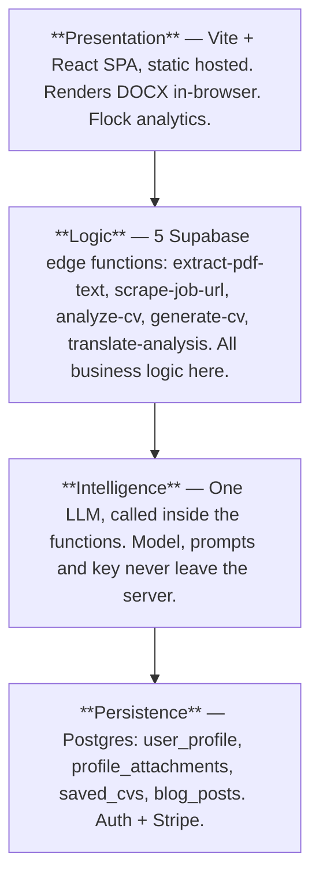
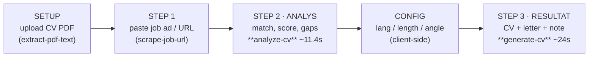
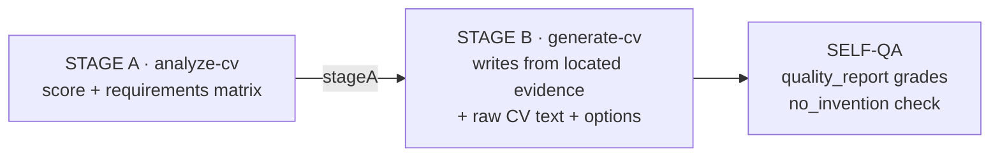
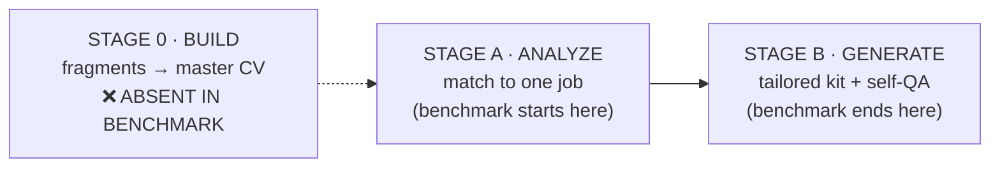
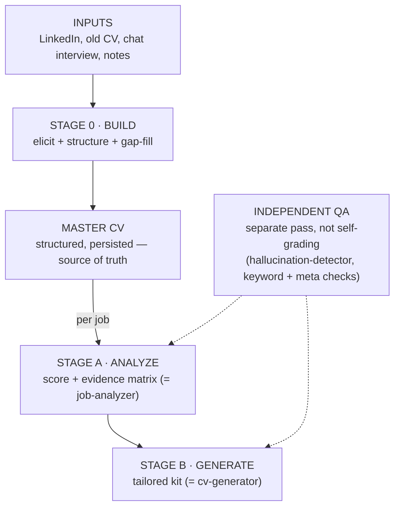

# Anatomy of a CV Engine

**Shortlisted.nu benchmark teardown — for the CV builder**

> How shortlisted.nu tailors a CV to a job spec, and the one stage it skips that a CV builder cannot.

| | |
|---|---|
| **Version** | 1.0 |
| **Date** | 2026-07-17 |
| **Subject** | shortlisted.nu |
| **Method** | Own authenticated session (network capture on a live run) |

Every schema, latency and score below was captured from a real generation on a logged-in account, not inferred from marketing copy. The exact prompts and model name run inside the edge functions and never reach the browser; where a claim rests on inference rather than captured bytes, it is marked.

**At a glance**

| Metric | Value | Note |
|---|---|---|
| LLM passes per application | **2** | Stage A (analyze) + Stage B (generate) |
| Edge functions carrying the logic | **5** | all server-side |
| Total wall-clock per tailored application | **~35s** | 11s + 24s measured |
| Functions that build a CV from raw input | **0** | the gap |

---

## Contents

1. The core finding — it tailors an existing CV, it does not build one
2. Architecture and stack
3. The end-to-end flow
4. Stage A: `analyze-cv` — the matcher and its transparent score
5. Stage B: `generate-cv` — the writer, grounded on Stage A, with self-QA
6. Output, bundling, persistence
7. The gap: the missing Stage 0 a CV builder lives on
8. Architecture for a real builder
9. What to steal
10. Method and limits

---

## 1. The core finding

Strip away the marketing and shortlisted.nu is a **two-stage, server-side LLM pipeline**. Stage one reads your existing CV plus a job advert and returns a structured match analysis with a transparent score. Stage two takes that analysis as grounding and writes a tailored CV, a cover letter and a LinkedIn note, then grades its own output against an anti-hallucination checklist. It is clean, fast and well-architected.

But the product begins by making you **upload a CV**. That uploaded document, flattened to raw text, *is* the user profile. Nothing in the system constructs a CV from a person's raw career history. Shortlisted does not build; it re-frames what you already have to point at one specific job.

> **THE FINDING THAT SHAPES EVERYTHING DOWNSTREAM**
>
> Shortlisted's "profile" is a CV you already wrote. Our product's **first job is to write that CV** from raw career input. The benchmark is a Stage A plus Stage B machine bolted onto a stage it never had to build.

So this teardown is worth twice over: the tailoring engine is a strong reference to copy, and its missing front end is precisely the part where a CV builder wins or loses.

**Two products hiding in one screen**

| What the benchmark does (Tailor) | What a builder must do first (Build) |
|---|---|
| Given a finished CV and a job ad, produce a role-adapted CV that scores higher against that ad. A rewriting and re-prioritising problem. Solved well here. | Given fragments (a LinkedIn export, an old CV, a chat interview, bullet notes), construct a coherent, complete master CV. A structuring, eliciting and gap-filling problem. Absent here. |

> **In one line:** the benchmark is the second half of our product. The first half is the half it does not have.

---

## 2. Architecture and stack

A thin client over Supabase. The interesting code is five edge functions, and the LLM they call sits behind them so the model and prompts never touch the browser.



*The whole product is a client, five functions and a hidden model. Because every model call is server-side, the teardown recovers the input and output of each function precisely, but the prompts and the exact model are unrecoverable from the outside.*

**The stack, itemised**

| Layer | Technology | Evidence |
|---|---|---|
| Frontend | Vite + React single-page app, static hosted | `index-*.js` hash bundle |
| Backend | Supabase (Auth + Postgres + Edge Functions) | 100+ supabase refs in bundle |
| Payments | Stripe, 7-day trial then 95 kr / week | stripe refs; checkout fns |
| Model | One frontier-class LLM, provider not exposed | no openai/anthropic in client |
| Bundling | DOCX generated client-side from JSON | docx lib in bundle, no fn call |
| Owner | "Del av Mx Advisory Group, Sverige" | page footer |

> **Design lesson worth keeping:** keeping the model call server-side is the correct pattern and one we already follow — prompts, provider and key stay private, and swapping models is a one-function change no client ships around.

---

## 3. The end-to-end flow

Four screens the user sees, five functions behind them, two of which are the expensive model calls. Everything before Stage A is data plumbing.



*The profile is built once (SETUP); the tailoring runs per job (Steps 1-3). Two model calls: one to judge fit, one to write. The config screen between them collects language, page count and a positioning angle that steers the writer.*

**The five functions**

| Function | Job | Kind | Our equivalent |
|---|---|---|---|
| `extract-pdf-text` | Flatten uploaded CV PDF to text (the whole profile) | plumbing | PDF parse |
| `scrape-job-url` | Fetch a job ad from a pasted URL | plumbing | api-search / scrapers |
| `analyze-cv` | Match CV to ad; return score + evidence matrix | **model** | job-analyzer |
| `generate-cv` | Write tailored CV + cover letter + LinkedIn note | **model** | cv-generator + cover letter |
| `translate-analysis` | Swap the analysis between Swedish and English | plumbing | - |

**Note.** There is no sixth function that assembles a CV from anything other than an already-written one. The pipeline assumes the CV exists on the very first screen.

---

## 4. Stage A: `analyze-cv` — the matcher

One model call turns raw CV text plus a job ad into a structured verdict: a score, a requirement-by-requirement evidence matrix, and an explicit breakdown of how the score was reached.

**What the client sends**

```jsonc
// POST /functions/v1/analyze-cv
{
  "job": { "title", "company", "description_text", "language_hint" },
  "options": { "output_language" },
  "profile": {
    "contact": { "firstName", "lastName", "email", "phone", "countryCode" },
    "documents_text": "9,114 chars of raw CV text",   // the whole profile
    "manual_fields": { "skills": [], "systems": [], "certifications": [], "languages": [] }
  },
  "profile_basis": { "documents_used": [ "..." ] }
}
```

**The tell.** The entire "profile" is `documents_text`, the flattened CV. The CV is never structured into fields; the model reads it raw. That works only because a CV already exists to read.

**What comes back** — `200 · 4.5 KB · 11.4s`

```jsonc
{
  "fit": {
    "match_score": 93,
    "confidence": "high",
    "strengths": [ ... ],
    "gaps": [ ... ],
    "matched_keywords": [ ... ],
    "missing_keywords": [ ... ],
    "recommended_focus": [ ... ],
    "adjacent_synergies": [ { "area", "description", "missing_for_direct", "strength" } ],
    "requirements_matrix": [ { "requirement", "category", "match_status", "evidence": [], "rationale" } ],
    "score_explanation": {
      "must_have_coverage": 100,
      "merit_coverage": 100,
      "synergy_bonus": 30,
      "penalties_applied": [],
      "final_weighted_score": 93
    },
    "recommendation": { "action": "apply_now", "alternative_suggestion": null, "positioning_tips": [], "why" }
  },
  "job": { "title", "company", "keywords": [], "must_have_requirements": [], "nice_to_have_requirements": [], "tasks": [] },
  "language": "sv",
  "_cached": false,
  "_inputHash": "7d7d0ba0a9cd4698"
}
```

**Cached by input hash.** Identical CV plus ad returns a stored result, so re-runs do not re-bill the model.

### The score is not a black box

The single best idea in Stage A: the match percentage ships with its own arithmetic. The model returns the components, so the number is defensible instead of magical.

| Component | Value |
|---|---|
| `must_have_coverage` | 100 |
| `merit_coverage` | 100 |
| `synergy_bonus` | +30 |
| `penalties_applied` | 0 |
| **`final_weighted_score`** | **93** |

> **The ceiling is deliberate.** Full coverage on both axes plus a 30-point synergy bonus still resolves to **93**, not 100. The formula is normalised so a perfect-looking profile never claims a perfect match. A believable 93 sells better than a suspicious 100.

### The evidence matrix

Each requirement parsed from the ad is matched to specific lines lifted from the CV. This is the object the writer is later handed, so the tailored CV is built from pre-located evidence, not re-derived.

| Requirement (parsed from ad) | Cat. | Status | Evidence located in CV |
|---|---|---|---|
| 10+ yrs senior commercial leadership in iGaming | must | Strong | Executive roles at named operators, 2009 to 2019 |
| Scale revenue and build high-performing teams | must | Strong | Scaled a team 1 to 100+; ~400% user growth in a year |
| Deep understanding of regulated EU markets | must | Strong | Launched 20+ brands across 10+ markets; listed firms |
| Product-led growth, data-driven decisions | must | Strong | Built BI team and predictive models from scratch |
| A Nordic language | merit | Strong | Native Swedish |

*Illustrative rows from the captured run against a fictional "Chief Commercial Officer" advert. Candidate specifics generalised.*

---

## 5. Stage B: `generate-cv` — the writer

The second call receives the entire Stage A output as a field named `stageA`, then writes the whole application kit and grades itself before returning.



*Generation is grounded, not free-form. Because Stage B is handed Stage A's evidence matrix, each experience bullet can be reframed around a specific matched requirement. This is why bullets in the output are prefixed with the job's own keywords. The writer never re-judges fit; it is handed the match and writes to it.*

**What the client sends**

```jsonc
// POST /functions/v1/generate-cv
{
  "merged_profile_text": "raw CV text",
  "options": { "cv_language": "en", "cv_length": "1", "role_focus": "commercial", "tone": "professional" },
  "stageA": { /* ..entire analyze-cv output.. */ }
}
```

`role_focus` is the positioning-angle chip from the config screen; `cv_length` is a page count.

**What comes back (the whole kit)** — `200 · 6.3 KB · 24s`

```jsonc
{
  "optimized_cv": { "sections": [ { "heading", "content" } /* x4 */ ] },
  "cover_letter": { "text" },
  "linkedin_message": { "enabled": true, "text" },
  "analysis_summary": { "match_score", "strengths": [], "gaps": [], "matched_keywords": [], "missing_keywords": [] },
  "language": "en",
  "meta": { "ok": true },
  "quality_report": {
    "ats_safe_passed": true,
    "language_consistency_passed": true,
    "must_have_addressed_passed": true,
    "no_invention_passed": true,
    "notes": [ ... ]
  }
}
```

One call, three deliverables (CV + cover letter + LinkedIn note) plus a self-graded quality report. The CV is an array of flexible `{ heading, content }` sections (4 for a 1-pager: *Expertise & Career Objective / Professional Experience / Education / IT & Languages*), not a fixed schema.

### The self-QA layer

The most quietly impressive part. Generation returns a verdict on its own content, including an explicit anti-fabrication gate — the same concern our pipeline handles with a separate hallucination-detector and unsupported-by-CV field, folded here into one response.

| Check | Result | Meaning |
|---|---|---|
| `ats_safe_passed` | passed | machine-parseable layout |
| `language_consistency_passed` | passed | one language throughout |
| `must_have_addressed_passed` | passed | every requirement covered |
| `no_invention_passed` | passed | no fabricated facts |

> **Honest caveat.** The quality report is the model grading itself in the same generation. It is a useful guardrail and a good UX signal, but it is not an independent check. A truly robust builder still wants a second, separate pass judging the first — closer to how our pipeline already separates QA into its own modules.

---

## 6. Output, bundling, persistence

The generated kit is JSON. The visible document, the DOCX and the saved application are all assembled from it, and the file conversion happens in the browser.

The Resultat screen exposes three deliverable tabs (**CV / Personligt brev / LinkedIn**), a **Spara CV** button (writes to `saved_cvs`) and **Ladda ner DOCX**. Bullets in the rendered CV are re-prefixed with the job's own keywords (`P&L:`, `Go-to-market:`), driven straight from Stage A's requirements matrix.

| Path | How |
|---|---|
| Rendered preview | `optimized_cv.sections` (heading + content) laid out live. Flexible, not a fixed CV schema. |
| DOCX export | Client-side via a bundled docx library. **No edge function fires.** Step-8-style bundling done in the browser. |
| Save + translate | Spara CV writes to `saved_cvs`; `translate-analysis` swaps SV and EN on demand. |

---

## 7. The gap: it tailors, it does not build

Everything so far assumes a finished CV on screen one. A CV builder has to earn that document first. That prerequisite is a whole stage the benchmark simply does not contain.



*The benchmark is the analyze and generate blocks. The absent block is our actual first problem, and shortlisted resolves it by outsourcing it to the user: "upload your CV". A CV builder exists precisely because the user does not have that document, or has a weak one.*

> **WHY THIS IS THE WHOLE GAME**
>
> If Stage 0 produces a strong master CV, our Stage A and Stage B can look a lot like the benchmark. If Stage 0 is weak, **no amount of tailoring rescues it**: the tailor only rearranges what the builder gave it.
>
> Shortlisted quietly proves the tailoring problem is solved and commoditised. The defensible work, and the harder work, is upstream: turning messy human career input into a document worth tailoring.

**What Stage 0 has to do that Stage A and B never touch**

| | |
|---|---|
| **Elicit** | Pull a full history out of a person who will not type it: LinkedIn import, an old CV, a guided chat interview, or bullet fragments. Ask for what is missing. |
| **Structure** | Turn that into a normalised master profile with dates, roles, achievements and metrics, deduplicated and ordered. The thing shortlisted assumes you uploaded. |
| **Fill gaps** | Detect thin sections, vague bullets and missing quantification, then prompt the user to strengthen them before any job is in sight. |
| **Persist as source of truth** | Keep the master CV as structured data, not a PDF, so every future tailoring reads clean fields, not re-flattened text. |

---

## 8. Architecture for a real builder

Keep the benchmark's strong second half almost verbatim. Add the front half it never needed. The result maps cleanly onto modules we already have.



*The only genuinely new build is Stage 0 and a durable master-CV store. Stage A and Stage B are the benchmark's design, which maps onto job-analyzer and cv-generator. QA becomes a separate module rather than the model grading itself, which is stronger than the benchmark.*

| Piece | Benchmark | Our builder | Status |
|---|---|---|---|
| Stage 0 build | None; user uploads | Elicit + structure + gap-fill to a master CV | **to build** |
| Master profile | Raw CV text | Structured, persisted source of truth | **to build** |
| Stage A analyze | `analyze-cv` | job-analyzer, add exposed score components | have |
| Stage B generate | `generate-cv` | cv-generator plus cover letter | have |
| QA | self-graded in-call | separate hallucination + keyword modules | have |
| Bundling | client DOCX | Step-8 DOCX / PDF | have |
| Cost control | input-hash cache | prompt caching (already shipped) | have |

> **The honest scope read.** Six of seven pieces already exist in some form. The product-defining work is one box: Stage 0, the CV builder proper. The benchmark confirms the rest is a solved problem — good news for scope, bad news for differentiation on tailoring alone.

---

## 9. What to steal

Five concrete moves from the benchmark, ranked by leverage, that improve our product with little cost.

1. **Expose the score components.** Return must-have coverage, merit coverage, synergy and penalties, not one opaque number. Makes the score defensible and gives the user a to-do list. Nearly free; our analyzer already computes the parts.
2. **Ground generation on an evidence matrix.** Pass Stage A's requirement-to-evidence map into the writer so bullets are reframed around located facts, not re-derived. Reduces invention and tightens relevance.
3. **Ship the whole kit in one call.** CV, cover letter and LinkedIn note from a single generation with a shared quality report. Fewer round-trips, guaranteed consistency across the three.
4. **Cache by input hash.** Same CV plus ad returns a stored result. Complements our prompt caching and stops re-billing identical retries outright.
5. **Keep a believable ceiling on the score.** Normalise so even a perfect profile lands in the low 90s, never 100. A suspicious perfect score erodes trust; a confident 93 reads as a real assessment. A one-line clamp with an outsized credibility payoff.

> **The one thing not to copy:** do not let the model grade its own work and call it QA. Keep the independent checking pass we already have.

---

## 10. Method and limits

**How it was captured**

1. Public reconnaissance first: pulled the client JS bundle and network log with no login, which revealed the Supabase project, the five function names, the tables and the absence of any provider string in the client.
2. Ran one real application on a logged-in account, driving the four-step flow with a fictional job advert so the analysis was meaningful.
3. Installed a fetch interceptor in the page to capture the exact request and response bodies of `analyze-cv` and `generate-cv`, stripping auth headers and tokens on read.
4. Read back the two payloads and derived the input and output contracts, latencies and the score arithmetic directly from captured bytes.

> **Scope discipline.** Everything was observed from a single authenticated session that belongs to us. No attempt was made to probe the backend, use the anon key against the database, enumerate other users, or touch any admin surface. The line held at "observe my own traffic".

**What stays hidden**

| Knowable from outside | Not knowable from outside |
|---|---|
| Every request and response schema | The exact prompts |
| Latencies and payload sizes | The model name and provider |
| The score arithmetic and its components | Temperature and generation params |
| The staging and grounding design | Server-side caching and rate policy |
| Tables, functions, client tech | Template internals behind the names |

**In short.** The contract is fully recovered; the wording inside the black box is inferred from input and output, never extracted. Where this report describes prompt intent, treat it as a well-grounded inference, not a quote.

> **Bottom line for the build:** copy the second half with confidence; it is a solved, commoditised pattern. Spend the real effort on **Stage 0, the part shortlisted made the user do for it.**

---

*Shortlisted benchmark teardown · v1.0 · 2026-07-17 · for the CV builder*
